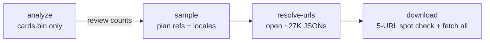

## Confirmed decisions

- **Ability "combination" definition** = **set of idGds present on the card** (any line, dedup'd, order-independent). This is the metric the sampler uses to guarantee combo coverage. `analyze` also reports the shape histogram (6+ shapes the user listed) and the strict 12-slot tuple count for context, but the canonical N is `N_set`.
- **Download URL strategy** = **prod host + dev hash via proxy**. Take the dev URL from JSON (`https://altered-dev.s3.eu-west-3.amazonaws.com/<rel-path>`), rewrite host to `https://altered-prod-eu.s3.amazonaws.com/<rel-path>` (same hash), then wrap in `https://www.altered.gg/_next/image?url=<urlencode(...)>&w=1200&q=75`. First `download` run spot-checks 5 random URLs and aborts on 404 unless `--force`, so we catch a hash mismatch early.
- **Tool location** = brand-new crate **`image-sampler/`** (kebab-case to match `index-core` / `cli-indexer` / `uniques-http-api`), added to the workspace `members`. The empty `alt-indexer/` is left untouched.
- **Budget arithmetic** = "0.5% of total images" = 0.5% of total **unique cards** (~27,280 cards), each downloaded at **one** locale chosen per the locale bias. Total downloads ≈ 27,280 images. (Multi-locale-per-card is supported via a CLI flag but off by default.)
- **Locales always available** (per user clarification, no per-card availability filtering needed).

## Why this ordering

The merged index at [`build/full_index/ALL_SETS`](build/full_index/ALL_SETS) already contains everything we need to count combos and sample:

- [`catalog.json`](build/full_index/ALL_SETS/catalog.json) → `(set, family_id, faction, family_number, max_unique_id, start_bit)` per family. We can iterate every card's `reference` without any JSON.
- [`cards.bin`](build/full_index/ALL_SETS/cards.bin) → 32-byte record per card containing the full 12-slot id_gd tuple (see [`index-core::compact::CompactCardView`](index-core/src/compact.rs)). This *is* the answer to "what abilities does this card have".
- `id_gd/*.roar` Roaring bitmaps are available if we want to count cards per id_gd, but for combo counting we just iterate `cards.bin` directly (one linear scan of ~175 MB).

So `analyze` and `sample` can run **without touching JSON**. JSON crawling is deferred to `resolve-urls`, which opens only the ~27K sampled files by deterministic path:

```
<root>/cards-unique-<SET>/json/<SET>/<faction>/<family_number>/<reference>.json
```

(Verified against the dataset, e.g. `cards-unique-EOLE/json/EOLE/AX/106/ALT_EOLE_B_AX_106_U_1.json`.)

## Tool layout

New crate `image-sampler/` added to the workspace ([`Cargo.toml`](Cargo.toml) `members`), with a single binary exposing subcommands so we can compose the pipeline incrementally:

```
image-sampler analyze       # count combos from cards.bin + catalog (no JSON)
image-sampler sample        # apply budget + biases, write plan.jsonl (refs only)
image-sampler resolve-urls  # open only the sampled JSONs, harvest image URLs
image-sampler download      # fetch images per plan, write tree + index.jsonl
```

Crate dependencies: `index-core`, `clap`, `anyhow`, `serde`, `serde_json`, `rand` + `rand_chacha` (deterministic sampling), `reqwest` (blocking client with rustls), `indicatif` (progress), `sha2` (download verification), `urlencoding`.

## Stage 1 — `analyze` (answer the count question, no JSON)

Loads `catalog.json` + memory-maps `cards.bin`. Walks each family's `[start_bit, start_bit + max_unique_id)` range, projects each non-padding record to:

- **set-of-idgds** (primary): sorted dedup of non-zero ids on the card. Encoded as `[u16; N]` and used as the canonical combo key.
- **shape** (context): bitmask of `(m1_present, m2_present, m3_present, ec_present)` where "present" = any of the 3 slots non-zero. Max 16 distinct shapes (likely 6–8 in practice; the user's 6 listed shapes match this).
- **strict 12-slot tuple** (context): `(u16; 12)` straight from `CompactCardView`.

Outputs (stdout + `out/analyze.json`):

- Total cards (incl. padding skipped), per-set and per-family counts.
- **`N_set`** — distinct set-of-idgds (the headline number, answers the user's first question).
- Histogram of `cards-per-set` so we can see singletons that *must* be picked deterministically by the sampler.
- Coupon-collector estimate `≈ N_set * (ln N_set + γ)` for "expected uniform draws to cover every combo" — answers the user's second question. We'll also report the exact minimum (`= N_set` if the sampler picks deterministically rather than uniformly random).
- Side tables: `N_shape` and `N_tuple` for comparison.

## Stage 2 — `sample` (no JSON)

Inputs: `--index-dir build/full_index --set ALL_SETS`, `--budget 27280` (or `--budget-fraction 0.005`), `--locale-weights en_US=50,fr_FR=35,de_DE=5,es_ES=5,it_IT=5`, `--combo-mode {set|shape|tuple}` (default `set`, per confirmed decision), `--seed 42`, `--out out/plan.jsonl`.

Algorithm:

1. Reload `cards.bin` to build, for each combo (set-of-idgds), the list of card bit-indices that own it (so we know which refs realize each combo).
2. **Reserve full coverage**: for every distinct combo, pick one representative card (seeded random within that combo's bucket). Approximately `N_set` slots out of the budget.
3. **Fill quotas**: distribute remaining budget across `(set, family_id)` pairs proportionally (largest-remainder method) so every family gets at least one card if the budget allows, and the rest is shared evenly. Within each family slot, pick the card whose combo is currently least-represented in the chosen set (greedy diversity).
4. **Assign locales**: for each chosen card, draw a locale from the weight distribution. Optional `--locales-per-card K` to attach multiple locales while still counting toward the budget.

Output `plan.jsonl` (one row per `(ref, locale)`):

```json
{ "ref": "ALT_EOLE_B_AX_106_U_1", "set": "EOLE", "faction": "AX", "family_id": "AX_106", "family_number": "106", "unique_id": 1, "locale": "en_US", "shape": "m1+ec", "tuple_id": "24,182,379|0,0,0|0,0,0|191,192,779" }
```

Plus `plan-summary.json` with counts per `(set, family, locale, combo)` so we can sanity-check the bias before resolving URLs.

## Stage 3 — `resolve-urls` (open only sampled JSONs)

Inputs: `--plan out/plan.jsonl`, `--equinox-root C:/Users/taumx/Documents/GitHub/equinox-cards`, `--out out/plan-resolved.jsonl`.

For each unique `ref` in the plan (dedupe across locales):

1. Compute path: `<equinox-root>/cards-unique-<SET>/json/<SET>/<faction>/<family_number>/<ref>.json`.
2. Parse with a narrow `serde` struct (just `imagePath` + `translations: BTreeMap<String, { image: Option<String> }>`).
3. For each `(ref, locale)` row, attach:
   - `rel_path` = `translations[locale].image` (or strip the host from `imagePath` for `en_US` if missing).
   - `dev_url` = `https://altered-dev.s3.eu-west-3.amazonaws.com/<rel_path>` (kept for debugging / fallback).
   - `prod_url` = `https://altered-prod-eu.s3.amazonaws.com/<rel_path>` (the URL we'll actually fetch, per confirmed strategy).
   - `proxy_url` = `https://www.altered.gg/_next/image?url=<urlencode(prod_url)>&w=1200&q=75` (single canonical URL passed to `download`).

Output `plan-resolved.jsonl` (superset of `plan.jsonl` rows with URL fields filled in). Missing-locale or missing-file rows go to `resolve-errors.jsonl`.

Worst case ~27K small file reads, hot in OS cache after first run. Parallelizable with a small thread pool.

## Stage 4 — `download` (fetch + store)

Reads `plan-resolved.jsonl` and writes the image tree:

```
out/images/<SET>/<faction>/<family_number>/<ref>/<locale>.jpg
out/images/index.jsonl    # one line per downloaded image
out/images/manifest.json  # summary: counts per set/family/locale/shape, seed, budget
```

`index.jsonl` per row: `{ ref, set, family_id, faction, unique_id, locale, shape, tuple_id, src_url, local_path, sha256, bytes }` — easy lookup by `(ref, locale)`.

Implementation notes:
- `reqwest::blocking::Client` with a small thread pool (manual `std::thread` or `rayon`); concurrency capped (default 4) to be polite to altered.gg.
- Resumable: skip rows where `local_path` already exists and `sha256` matches (`--force` to override).
- Retries with backoff on 5xx / network errors; 404s go to `errors.jsonl` (these will identify any prod-vs-dev hash mismatches in the data; we can run a follow-up that retries with the `dev_url` field already recorded).
- **First-run spot check**: before downloading the full plan, fetch 5 random URLs synchronously and report HTTP status. If any return 404, abort with a clear message unless `--force` is set. Avoids burning the whole run on a wrong URL pattern.
- Proxy + width + quality are configurable via `--no-proxy`, `--width 1200`, `--quality 75`.

## Recommended sequencing



`analyze` and `sample` are pure local computation over the existing index; ship those first, get the user's confirmation on the budget/coverage numbers, then resolve URLs and download.

## Files we'll add / touch

- New: [`image-sampler/Cargo.toml`](image-sampler/Cargo.toml), [`image-sampler/src/main.rs`](image-sampler/src/main.rs), [`image-sampler/src/cli.rs`](image-sampler/src/cli.rs), [`image-sampler/src/analyze.rs`](image-sampler/src/analyze.rs), [`image-sampler/src/sample.rs`](image-sampler/src/sample.rs), [`image-sampler/src/resolve.rs`](image-sampler/src/resolve.rs), [`image-sampler/src/download.rs`](image-sampler/src/download.rs), [`image-sampler/src/url.rs`](image-sampler/src/url.rs) (proxy + host rewriting helpers), [`image-sampler/plans/01-image-sampler.md`](image-sampler/plans/01-image-sampler.md) (this plan, per the plans-folder rule).
- Modified: [`Cargo.toml`](Cargo.toml) — add `image-sampler` to `members`.
- No changes to `index-core`, `cli-indexer`, `uniques-http-api`, or `alt-indexer`.

## What I'll deliver first (one PR-sized increment)

1. Scaffold the `image-sampler` crate with `analyze` only.
2. Run `analyze` against the merged index and post the actual numbers in chat (headline = `N_set`, plus shape/tuple side tables) so we can decide the sampling coverage target.
3. Wait for confirmation before implementing `sample`, `resolve-urls`, and `download`.
