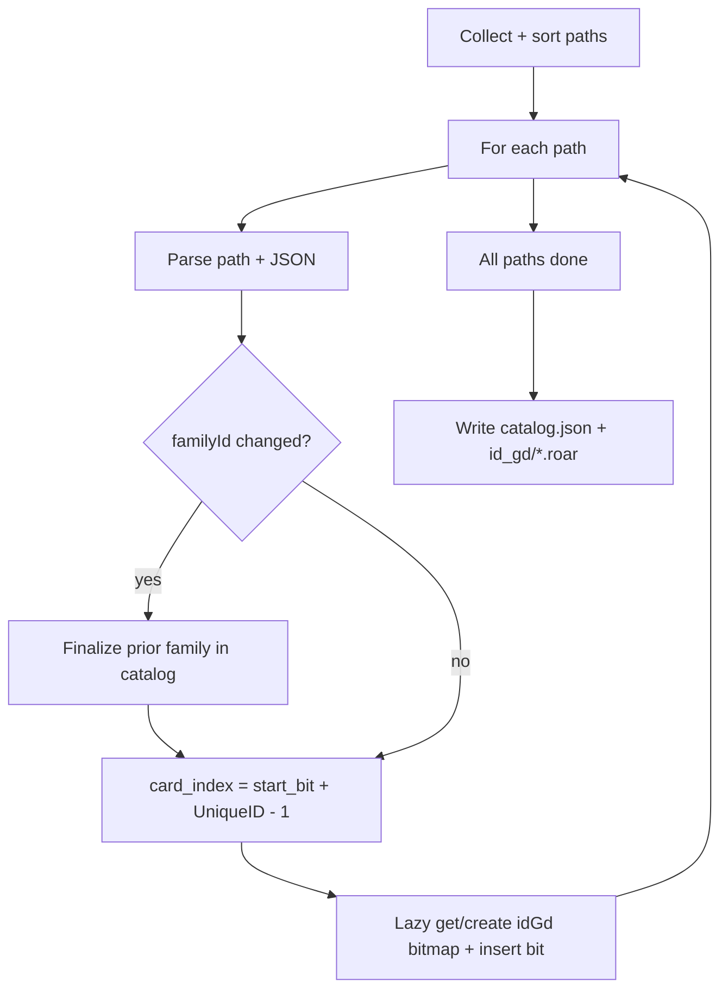

# Plan: idGd Bitset Indexer CLI

## Goal

Build a Rust CLI (`alt-indexer`) that crawls a card dataset folder, extracts `cardEffectElements` (especially `idGd`), and writes one Roaring bitmap per `idGd`. Each set bit represents one unique card in a stable global ordering so we can recover the card `reference` string from a bit index without storing the reference in every bitmap.

**FOILER cards are ignored completely and are not indexed.**

## Terminology

### UniqueID

The numeric suffix after `_U_` in a card filename (e.g. `5` in `ALT_COREKS_B_AX_06_U_5`).

- **Unique within a `familyId`** (`faction` + `familyNumber`): no two cards in the same family share the same UniqueID.
- **Not unique across the project**: the same UniqueID can appear in different families or sets.
- Encoded in the path/filename; the indexer treats it as the per-family serial number of a unique print.

### `card_index` (global bit position)

A dense integer assigned to each card file within a set universe. Used as the bit position in Roaring bitmaps.

Within a family, **`card_index` is aligned with UniqueID**:

```text
card_index = family.start_bit + (UniqueID - 1)
```

This alignment is intentional: reverse lookup from a bit index recovers the UniqueID even when some UniqueIDs are missing on disk (gaps).

### `familyId`

`{faction}_{familyNumber}` — identifies a card family. Each family has its own UniqueID namespace and its own variable number of cards.

## Assessment of the Bit-Index Scheme

### What works well

- **Dense global ordering**: Cards from all families are laid out back-to-back in a single bit space per set.
- **Compact reverse lookup**: A prefix catalog records each family's `start_bit` and `maxUniqueID`; decode is `O(log F)` families.
- **Variable family sizes**: The number of cards per `familyId` is **not fixed**. One family may have hundreds of uniques, another thousands. The catalog captures the span per family.
- **Separation of concerns**: Bitmaps store membership only; the catalog stores how to interpret bit positions.
- **Per-set universes**: `COREKS`, `ALIZE`, and `BISE` each get their own catalog and `id_gd/` output. Bit numbers are not comparable across sets.

### Core assumptions

| Assumption | Handling |
|------------|----------|
| UniqueIDs are unique within a `familyId` | Duplicate paths are an error at crawl time |
| UniqueIDs are usually contiguous `1..max` | Gaps are exceptional |
| Gaps in UniqueIDs (e.g. 1, 2, 4 but no 3) | Reserve the bit slot at `start_bit + (UniqueID - 1)`; leave it unset in bitmaps. Decode still yields the expected UniqueID for that bit |
| Path `faction` defines `familyId` | Use path, not `mainFaction.reference` from JSON, for ordering |
| Foiler (`NE/00`) | Ignored — skip any path or filename containing `FOILER` |
| `idGd` on `cardEffectDisplays` | Actually on **`cardEffectElements`** under `cardEffect` |

There is **no fixed stride** per family. That is why we build a reverse-index catalog rather than inferring family boundaries from arithmetic alone.

## Single-Pass Build (in memory, disk at end)

There is **one crawl** over the dataset. We do **not** buffer card JSON or file lists between separate passes. During the crawl we update everything in memory; **only at the end** do we write `catalog.json` and the `id_gd/*.roar` files.

### What stays in memory

| Structure | Purpose |
|-----------|---------|
| **`catalog` builder** | Grows as families are finalized: `start_bit`, `maxUniqueID`, `card_count` |
| **`id_gd_bitmaps`**: `HashMap<u32, RoaringBitmap>` | Lazy map — create a new bitmap the first time an `idGd` is seen |
| **Current-family scratch** | Track `maxUniqueID` and `card_count` for the family being processed; dropped when the family is finalized |

We do **not** keep a second copy of the dataset in memory (no vec of all paths after a separate pass, no stored JSON bodies).

### Crawl order

Filesystem order is arbitrary, but `start_bit` for a family depends on all **prior** families in catalog order. Before processing cards, collect paths (paths only — lightweight), **sort** by:

1. Faction order: `AX → BR → LY → MU → OR → YZ`
2. `familyNumber` ascending (numeric)
3. UniqueID ascending (numeric)

Then walk the sorted list once.

### Per-file loop (same pass)

For each path (skip `FOILER`):

1. Parse `familyId`, UniqueID; load JSON; extract `idGd` values (dedupe per card).
2. **Family transition**: when `familyId` changes, finalize the previous family — push catalog entry (`start_bit`, `maxUniqueID`, `card_count`), then  
   `start_bit(next) = start_bit(current) + maxUniqueID(current)`.
3. **Current family**: update `maxUniqueID`, increment `card_count`.
4. **Bitmaps immediately**:  
   `card_index = current_family.start_bit + (UniqueID - 1)`  
   For each `idGd`, `id_gd_bitmaps.entry(id_gd).or_insert_with(RoaringBitmap::new).insert(card_index)`.
5. After the last file, finalize the last family.

### End of build

1. Serialize `catalog.json` and `manifest.json`.
2. Write every `id_gd/{id}.roar` from the in-memory map (only `idGd` values that appeared at least once).



### Why sort paths instead of two passes?

`card_index` can be computed as soon as we know the current family's `start_bit`. That is known when we **enter** the family (after finalizing the previous one). We only learn the final `maxUniqueID` when we **leave** the family, which is fine — bitmap inserts use UniqueID alignment and do not depend on the final max until the next family starts.

## Decode Formula

Given sorted catalog entries with `start_bit`, `faction`, `familyNumber`, `maxUniqueID`:

```text
find last entry where start_bit <= bit
UniqueID = bit - start_bit + 1
reference = ALT_{SET}_B_{faction}_{familyNumber}_U_{UniqueID}
```

If `UniqueID > maxUniqueID` for that family, the bit falls in a padding slot (should not appear in bitmaps).

### Example (variable family sizes)

| start_bit | familyId | maxUniqueID | bit range (inclusive) |
|-----------|----------|-------------|------------------------|
| 0 | AX_04 | 4200 | 0..4199 |
| 4200 | AX_05 | 5800 | 4200..9999 |
| 10000 | AX_06 | 150 | 10000..10149 |

- Bit `0` → `ALT_COREKS_B_AX_04_U_1`
- Bit `4199` → `ALT_COREKS_B_AX_04_U_4200`
- Bit `4200` → `ALT_COREKS_B_AX_05_U_1`
- Bit `10345` → `10345 - 4200 + 1` = **6146** → `ALT_COREKS_B_AX_05_U_6146`
- Bit `10050` → `10050 - 10000 + 1` = **51** → `ALT_COREKS_B_AX_06_U_51`

Note: `AX_05` uses 5800 slots while `AX_04` uses only 4200. The catalog records each family's span explicitly.

### Gap example

Family `AX_05` with `start_bit = 4200`, `maxUniqueID = 100`, files only for UniqueIDs `1, 2, 4, …, 100`:

- UniqueID `3` → bit `4202` — no file; no bit set in any `idGd` bitmap
- UniqueID `4` → bit `4203` — card present; bit set when indexing

Reverse lookup bit `4202` still yields UniqueID `3` and reference `..._U_3`.

## CLI Design

### Commands (initial)

```text
alt-indexer build --root <dataset-root> --set <SET> --out <output-dir>
alt-indexer decode --set <SET> --catalog <path> --bit <n>
alt-indexer query --set <SET> --index-dir <path> --id-gd <n>
```

### `build` steps

1. Discover paths under `json/<SET>/`, skip `FOILER`, sort by faction / `familyNumber` / UniqueID.
2. Single loop: maintain catalog + lazy `idGd` bitmaps; set bits as each card is read.
3. On exit: write `catalog.json`, `id_gd/*.roar`, and `manifest.json`.

## Data Extraction

### JSON traversal path

```text
cardElements[]
  └── cardEffectDisplays[]
        └── cardEffect
              └── cardEffectElements[]
                    └── idGd: u32
```

### Path parsing

```text
json/(?P<set>[^/]+)/(?P<faction>[A-Z]{2})/(?P<familyNumber>\d+)/ALT_(?P=set)_B_(?P=faction)_(?P=familyNumber)_U_(?P<uniqueId>\d+)\.json
```

## Output Layout

```text
<out>/
  <SET>/
    manifest.json
    catalog.json
    id_gd/
      23.roar
      90.roar
```

### `catalog.json` schema (draft)

```json
{
  "set": "COREKS",
  "faction_order": ["AX", "BR", "LY", "MU", "OR", "YZ"],
  "families": [
    {
      "start_bit": 0,
      "faction": "AX",
      "familyNumber": "04",
      "familyId": "AX_04",
      "maxUniqueID": 4200,
      "card_count": 4198,
      "first_reference": "ALT_COREKS_B_AX_04_U_1"
    },
    {
      "start_bit": 4200,
      "faction": "AX",
      "familyNumber": "05",
      "familyId": "AX_05",
      "maxUniqueID": 5800,
      "card_count": 5800,
      "first_reference": "ALT_COREKS_B_AX_05_U_1"
    }
  ],
  "total_bit_span": 10150
}
```

- **`maxUniqueID`**: size of this family's slot in the global bit space (finalized when leaving the family during the crawl).
- **`card_count`**: files actually found (≤ `maxUniqueID` when gaps exist).
- **`total_bit_span`**: sum of all family spans; upper bound on meaningful bit indices.

### Per-`idGd` Roaring file

- Filename: `{id_gd}.roar`
- Bit `card_index` set for each card containing that `idGd` (dedupe multiple occurrences on the same card to one bit).

## Crate Dependencies

| Crate | Purpose |
|-------|---------|
| `roaring` | Bitmap storage and set ops |
| `serde` / `serde_json` | JSON + catalog I/O |
| `clap` | CLI |
| `walkdir` | Directory crawl |
| `regex` | Path parsing |
| `anyhow` / `thiserror` | Errors |
| `rayon` (optional) | Parallel JSON parse after path sort |

## Module Structure

```text
src/
  main.rs
  cli.rs
  crawl.rs
  path.rs              # reference, familyId, UniqueID parsing
  card.rs
  catalog.rs           # incremental catalog, finalize family, decode
  id_gd.rs
  bitmap.rs            # lazy HashMap<idGd, RoaringBitmap>, flush to disk
```

## Implementation Phases

### Phase 0 — Scaffolding

- [ ] Dependencies, `clap` stubs, path parser tests (`tmp/`)

### Phase 1 — Build loop

- [ ] Path discovery, sort, skip `FOILER`
- [ ] Incremental catalog + lazy `idGd` bitmaps during crawl
- [ ] Flush `catalog.json` and `id_gd/*.roar` at end
- [ ] `decode`: bit → `reference` via UniqueID alignment

### Phase 2 — Query / ergonomics

- [ ] `query` subcommand (load bitmap + catalog)

### Phase 3 — Multi-set ergonomics

- [ ] Batch builds, progress logging
- [ ] Cross-link `docs/card-format.md`

## Testing Strategy

- **Unit tests**: `card_index = start_bit + UniqueID - 1`, decode with variable `maxUniqueID`, gap leaves bit unset
- **Fixtures**: `tests/card-json/` sample files
- **Integration** (local): subtree of `cards-unique-COREKS`

## Open Questions

1. Dedupe multiple `idGd` on one card to one bit? **Default: yes.**

## Success Criteria

- `build` on a full set root completes without panics
- `decode --bit N` matches the card at that logical position (UniqueID alignment)
- `query --id-gd` counts match spot-checks

## Related Docs

- [docs/card-format.md](../docs/card-format.md) — path layout, `familyId`, UniqueID
