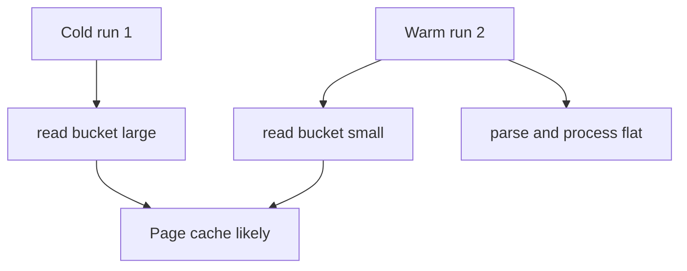

# Build performance analysis

## Goal

Understand why `alt-indexer build` is much slower on the first run than on subsequent runs over the same JSON files, and how to measure time spent on **reading** vs **processing** each card.

---

## Summary

**The indexer does not cache anything between runs.** Each build re-walks the dataset, re-reads every JSON file, re-parses it, and rewrites all outputs. A large speedup on a second run is almost always:

1. **OS page cache** — JSON already in RAM after the first read
2. **Warm directory metadata** — `WalkDir` / MFT lookups cheaper
3. **Windows Defender / AV** — less work on recently opened files

If the “first run” was `cargo run` after a code change, **Rust compilation** may also explain part of the gap (separate from indexing).

---

## What each build does


Per-card loop in [`src/build.rs`](../src/build.rs):

- `load_card(&file.path)` — one `read_to_string` + one `serde_json` parse in [`src/card.rs`](../src/card.rs)
- `effects_from_card(&card)` and `compact_fields_from_card(&card)` — CPU only, no second I/O

End phase writes: `catalog.json`, `id_gd/*.roar`, `cards.bin`, `stats/**`, `factions/**`, summaries, `manifest.json`. No incremental or “skip unchanged” logic.

---

## First run vs second run

| Factor | Cold (run 1) | Warm (run 2) |
|--------|--------------|--------------|
| Page cache | Reads hit disk or network | Reads mostly from RAM |
| Directory metadata | Cold tree walk | Often cached |
| AV / indexing (Windows) | Scan on first open | Usually cheaper |
| CPU (parse + bitmaps) | Same | Same |
| Output writes | Full rewrite | Full rewrite (smaller win than input) |

**Writes do not explain most of the speedup.** Run 2 still rewrites all `id_gd/*.roar` files. If `--out` is fresh but `--root` is the same, input cache still makes run 2 much faster.

**Does not explain the gap:**

- Application-level caching (not implemented)
- Roaring bitmap reuse (rebuilt every run)
- Sparse `stats_summary.json` format (output only)

~~The double-read~~ (removed) was constant overhead every run; it did not cause “second run faster” by itself.

---

## Measuring fairly

1. Use a **release** binary: `cargo build --release`, then time `alt-indexer build` only (not `cargo run` in the loop).
2. Same `--root` and `--set`; compare cold vs back-to-back warm run.
3. Optional cold check: reboot or clear cache — run 3 should resemble run 1.
4. Network roots (`\\server\...`) amplify cache effects on the client.
5. Different `--out` each time: input cache still applies; output dir warmth is a smaller factor.

### Quick verification (no code changes)

1. Time two back-to-back builds (release, same args).
2. Clear OS cache (reboot) and time a third build — expect slow again.
3. If run 2 is fast mainly in the per-card phase, page cache is the likely cause.

---

## Profiling: read vs parse vs process

### Buckets

| Bucket | Includes | Location |
|--------|----------|----------|
| `discovery` | `WalkDir` + sort | [`src/crawl.rs`](../src/crawl.rs) |
| `read` | `fs::read_to_string` | `load_card()` (once per card) |
| `parse` | `serde_json::from_str` | After read |
| `process` | Effect extraction, compact fields, bitmap inserts | Build loop, no I/O |
| `write` | All output files | End of [`src/build.rs`](../src/build.rs) |

**Label `read` as I/O read, not “disk”.** On a warm cache, `read_to_string` is mostly memory copy. Compare run 1 vs run 2 to separate cache from CPU.

### Recommended: `--profile` on `build` (implemented)

Use `--profile` on `build`, or set `ALT_INDEXER_PROFILE=1` (or `true`). When disabled, no timing overhead is recorded.

On an interactive terminal (stderr TTY), the build progress bar updates every second on **two lines**: throughput/ETA, then rolling **5-second average** read / parse / process milliseconds per card. Phase sampling also runs when `--profile` is on (even without a TTY).

```text
build profile (N cards):
  discovery     1.2s   (  2%)
  read          45.0s  ( 62%)
  parse         12.0s  ( 17%)
  process        8.0s  ( 11%)
  write          5.5s  (  8%)
  total         71.7s
```

**Implementation plan:**

1. Add `src/profile.rs` — `BuildProfile` with nanosecond accumulators; print summary at end of build.
2. ~~Refactor to one read + one parse per card~~ — done via `load_card` + `effects_from_card` / `compact_fields_from_card`.
3. Pass `Option<&mut BuildProfile>`; when profiling is off, skip `Instant::now()` entirely.
4. Optional: log total bytes read to correlate with parse time.

### External tools (no code)

| Tool | Good for |
|------|----------|
| Performance Monitor / Process Explorer | OS-level CPU vs disk |
| Process Monitor (Procmon) | Per-file read latency |
| Two `Instant`s in `build.rs` | Loop vs write only (coarse) |

`cargo flamegraph` shows CPU stacks, not blocked I/O — weak alone for “disk vs parse”.

### How to read results



- Run 1: high `read` → cold I/O + maybe AV.
- Run 2: `read` drops, `parse`/`process` flat → OS cache, not app cache.
- `parse` high on both runs → single-parse, smaller `CardJson`, or faster deserializer.
- `write` high on both → batch or shard `id_gd` output.

---

## Future optimizations (after profiling)

| Change | Effect |
|--------|--------|
| ~~Single read + parse per card~~ | Done — `load_card` in build loop |
| `mmap` for JSON | Helps cold runs; less when cache warm |
| Fewer / sharded `id_gd` files | Faster write phase |
| Parallel per-file processing | Best when parse-bound and I/O cached |

These improve every run; they do not replace OS page cache behavior.

---

## Related docs

- [idgd-bitset-indexer.md](idgd-bitset-indexer.md) — crawl order and bitmap model
- [idgd-compact-card-format.md](idgd-compact-card-format.md) — `cards.bin` layout
- [stats-indexer.md](stats-indexer.md) — stat and faction bitmaps
