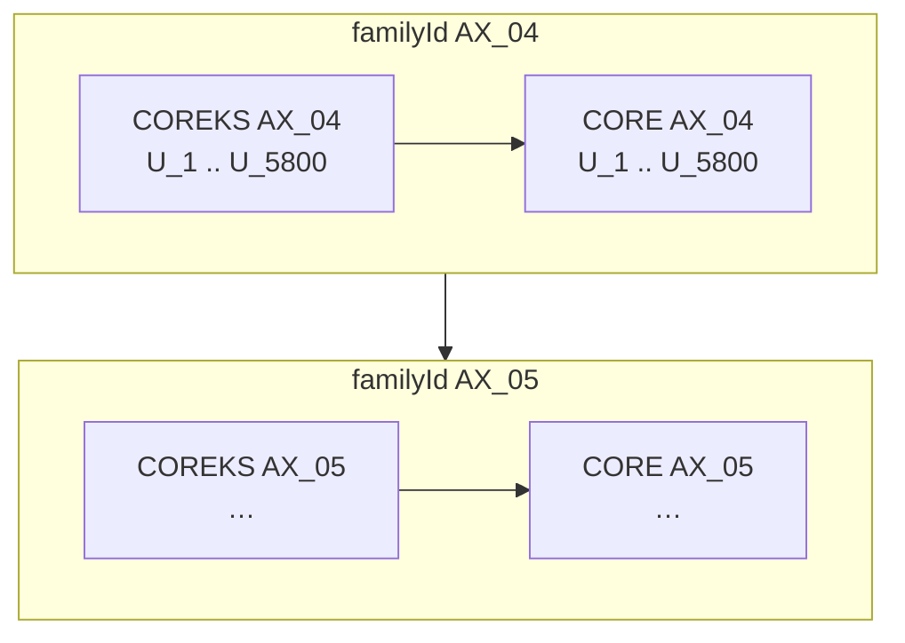

# Merge indexes (multi-set union)

## Goal

Add an `alt-indexer merge` step that takes **two or more existing per-SET indexes** (produced by `build`) and writes **one new index** whose on-disk layout matches a normal SET index (same files as `build` writes under `<out>/<SET>/`, but written **directly** under `--out`). The merged index is a single **global card universe**: every card from every source set appears exactly once, with stable `card_index` values suitable for Roaring bitmaps, `cards.bin`, stats, and factions.

The user chooses **which source sets to include** and **in what order sets are ordered within each `familyId`**. Cards are laid out in the merged bit space by **`familyId` → set → UniqueID**, so the same `familyId` across expansions (e.g. `AX_04` in CORE and COREKS) forms one contiguous bloc in every bitmap and in `catalog.json`. Set order affects placement inside that bloc, not membership.

## Motivation

Today each expansion is built independently:

```text
alt-indexer build --root … --set CORE   --out ./full_index
alt-indexer build --root … --set ALIZE  --out ./full_index
```

Queries such as “how many cards across CORE + ALIZE have `idGd` 42?” require loading and combining bitmaps from multiple directories. A merged index provides:

- One `catalog.json` and one `total_bit_span` for cross-set analytics
- One `id_gd/` tree keyed by `idGd` with union membership
- Existing `query` / `decode` tooling usable with `--index-dir` = parent of `--out` and `--set` = basename of `--out` (same convention as today’s per-SET folders; after small catalog changes for decode)

Merge is **offline composition of indexes** — it does not re-walk JSON and does not change per-set builds.

## CLI (proposed)

```text
alt-indexer merge
  --index-dir <parent>     # directory containing per-SET folders (e.g. ./full_index)
  --sets <ORDERED_LIST>    # comma-separated SET codes; order = set precedence within each familyId
  --out <output-dir>       # full path to the merged index root (e.g. ./merged_index/COREKS_CORE)
```

Example:

```text
alt-indexer merge \
  --index-dir ./full_index \
  --sets COREKS,CORE,ALIZE,BISE \
  --out ./merged_index/COREKS_CORE
```

Writes: `./merged_index/COREKS_CORE/manifest.json`, `./merged_index/COREKS_CORE/catalog.json`, etc.

Unlike `build --out`, which is a **parent** directory (`build` creates `<out>/<SET>/`), `merge --out` is the **complete destination folder** for the merged index.

### Parameters

| Flag | Required | Meaning |
|------|----------|---------|
| `--index-dir` | yes | Root that contains `<SET>/catalog.json` for each source |
| `--sets` | yes | Ordered list of source SET codes; **within each `familyId`, earlier sets occupy lower `card_index` ranges** |
| `--out` | yes | Output directory for the merged index (created if missing; all artifacts written here) |

**`catalog.set` / `manifest.set`:** derived from the **last path component** of `--out` (e.g. `--out ./merged_index/ALL` → `ALL`). This matches how `build` names the SET from `--set` and keeps `query --index-dir ./merged_index --set ALL` working.

Optional (later):

| Flag | Meaning |
|------|---------|
| `--force` | Overwrite existing files under `--out` |
| `--profile` | Phase timings (read catalogs, remap bitmaps, write) |

### Input validation

For each entry `S` in `--sets` (in order):

1. `<index-dir>/<S>/manifest.json` exists and `manifest.set == S`
2. `<index-dir>/<S>/catalog.json` exists
3. `<index-dir>/<S>/cards.bin` exists and length matches `catalog.total_bit_span * RECORD_SIZE`
4. Required sidecar files present: `id_gd/`, `idgd_catalog.json`, `stats_summary.json`, `factions_summary.json` (and their bitmap dirs if summaries reference them)

Fail fast on missing inputs, SET name mismatch, or `total_bit_span` / `cards.bin` size inconsistency.

## Ordering semantics

Merged `card_index` values are **not** “all of set A, then all of set B”. They follow a global sort so each **`familyId` is one contiguous bloc** across all source sets, with sets interleaved inside that bloc.

### Sort key

For every card in every source index, the merged position is determined by:

```text
1. familyId     (e.g. AX_04 — faction + familyNumber; same string as catalog family_id, without SET)
2. source set   (order given by --sets: S₀, then S₁, …)
3. UniqueID     (1 .. max_unique_id within that source family; gaps preserved)
```

Equivalently, within a source family row `(source_set, family_id, start_bit, max_unique_id)`:

```text
merged_card_index = block_start(family_id, source_set) + (source_card_index - source_family.start_bit)
                  = block_start(family_id, source_set) + (UniqueID - 1)
```

`block_start` is assigned by walking **sorted `familyId` keys**, then **sets in `--sets` order**, appending each source family’s `max_unique_id` span (same slot count as in the source catalog, including padding for missing UniqueIDs).

### Why interleave by `familyId`

Expansions such as CORE and COREKS reuse the same path-level `familyId` values (`AX_04`, `AX_05`, …). Concatenating whole sets would separate shared families by hundreds of thousands of bits. Interleaving keeps **all prints of one family together**, which matches how designers think about families and keeps cross-set queries/locality aligned with `familyId`.

### Example (`--sets COREKS,CORE`)

Abbreviated reference sequence in merged bit order:

```text
ALT_COREKS_B_AX_04_U_1
…
ALT_COREKS_B_AX_04_U_5800
ALT_CORE_B_AX_04_U_1
…
ALT_CORE_B_AX_04_U_5800
ALT_COREKS_B_AX_05_U_1
…
ALT_COREKS_B_AX_05_U_4200
ALT_CORE_B_AX_05_U_1
…
ALT_CORE_B_AX_05_U_6500
ALT_COREKS_B_AX_06_U_1
…
```

- **`AX_04` bloc**: entire COREKS `AX_04` span, then entire CORE `AX_04` span.
- **`AX_05` bloc**: COREKS `AX_05`, then CORE `AX_05`, and so on.
- Set order comes from `--sets` (COREKS before CORE here). Reversing to `CORE,COREKS` swaps the two sub-ranges inside each `familyId` bloc only.

### `familyId` ordering across families

Sort distinct `familyId` values globally the same way `build` orders families in a single set:

1. Faction: `AX → BR → LY → MU → OR → YZ` ([`FACTION_ORDER`](../src/catalog.rs))
2. `familyNumber` ascending (numeric)

Only `familyId`s that appear in **at least one** source catalog are included. If CORE has `AX_04` but ALIZE does not, the `AX_04` bloc still contains only the sets that actually have that family row.

### Bit-space layout (diagram)



### Remap table (implementation)

Before writing outputs, build `remap: HashMap<(source_set, source_card_index), merged_card_index>` (or a per-source `Vec<u32>` parallel to each source’s `total_bit_span`):

1. Load all source `catalog.json` files.
2. Collect every source `FamilyEntry` with its `source_set` (= manifest set name).
3. Group entries by `family_id`; sort group keys by faction + `family_number`.
4. `next_bit = 0`. For each `family_id` in order, for each `S` in `--sets` order:
   - If source `S` has a family row for this `family_id`, set `block_start(S, family_id) = next_bit`, then `next_bit += max_unique_id` (use the source row’s span, not `card_count`).
5. For each source family row, for `u` in `1..=max_unique_id`:  
   `remap[S][start_bit + u - 1] = block_start(S, family_id) + u - 1` (only where the source had a set bit / record is optional for padding slots).

All Roaring bitmaps, `cards.bin`, `stats/`, and `factions/` use this remap when combining sources.

**`--sets` order only affects numbering inside each `familyId`**, not membership. Reordering `--sets` permutes set sub-ranges within each family bloc.

**`total_bit_span`** = sum of all source `total_bit_span` values (same as concatenating spans; only the arrangement changes).

## Output layout

Identical to a normal `build` output ([stats-indexer.md](stats-indexer.md), [idgd-bitset-indexer.md](idgd-bitset-indexer.md)):

```text
<out>/
  manifest.json
  catalog.json
  cards.bin
  idgd_catalog.json
  id_gd/
    <id>.roar
  stats/
    <field>/<value>.roar
  stats_summary.json
  factions/
    <faction>.roar
  factions_summary.json
```

## Per-artifact merge rules

### 1. `catalog.json`

- **`set`**: basename of `--out` (e.g. `COREKS_CORE`), not any single source name.
- **`faction_order`**: unchanged global order (`AX → … → YZ`); same as single-set builds.
- **`families`**: one row per **(source set, family)** that exists in any input, emitted in **merged walk order** (`familyId` sort, then `--sets` order):
  - `start_bit` = `block_start(source_set, family_id)` from the remap plan above
  - `source_set` = source manifest set name (e.g. `COREKS`, `CORE`)
  - `faction`, `family_number`, `family_id`, `max_unique_id`, `card_count`, `first_reference` copied from that source’s family row
- **`total_bit_span`**: `next_bit` after the walk (equals sum of source spans).

Multiple rows may share the same `family_id` (different `source_set`); they appear **back-to-back** inside the global `familyId` bloc. `decode_bit` uses `source_set` to build `ALT_{source_set}_B_{faction}_{familyNumber}_U_{uniqueId}`.

**Schema extension (required):** `source_set` on each `FamilyEntry` (always set for merge output).

`first_reference` is copied verbatim from the source row (already contains the correct SET code).

### 2. `id_gd/*.roar`

For each `id_gd` that appears in any source:

1. Load all source bitmaps for that `id_gd` (skip missing files).
2. For each source set `S` and each set bit `b` in `S`’s bitmap, insert `remap[S][b]` into the merged bitmap.
3. Write `<out>/id_gd/{id_gd}.roar`.

Union semantics: a card appears in the merged `idGd` bitmap iff it appeared in **any** source set for that `idGd`.

### 3. `cards.bin`

- Merged file length: `merged_total_bit_span * RECORD_SIZE`.
- For each source set `S` and each source `card_index` with a compact record, copy the record to `remap[S][card_index]`.
- Padding slots (gaps in UniqueID alignment) remain zero-filled in the merged file, matching source sparsity per `(familyId, source_set)` block.

No JSON re-read; binary copy only.

### 4. `stats/` and `factions/`

Same per-bit remap as `id_gd`:

- For each source bucket file (e.g. `stats/main_cost/07.roar` under set `S`), map each bit `b` → `remap[S][b]` and OR into the merged bucket for the same field/value (or faction code).
- Rebuild `stats_summary.json` and `factions_summary.json` from merged bitmap cardinalities (same shape as `build`).

### 5. `idgd_catalog.json`

- **`set`**: basename of `--out`.
- **`entries`**: union of all `id_gd` values across sources.
- For each `id_gd`:
  - **`card_count`**: cardinality of merged `id_gd` bitmap (recomputed).
  - **`bitmap_file`**, **`bitmap_bytes`**: from merged write.
  - **`element_type`**, **`translations`**: take from the **first** source in `--sets` order that defines the entry; if later sources disagree on `element_type` or translation text for the same locale, log a warning (do not fail merge in v1).

### 6. `manifest.json`

Standard fields with merged totals, plus provenance:

```json
{
  "version": 1,
  "set": "ALL",
  "kind": "merge",
  "built_at_secs": 0,
  "card_count": 0,
  "id_gd_count": 0,
  "total_bit_span": 0,
  "family_count": 0,
  "merge": {
    "index_dir": "./full_index",
    "source_sets": ["CORE", "ALIZE", "BISE"],
    "source_manifests": [
      { "set": "CORE", "card_count": 842268, "total_bit_span": 842268 },
      { "set": "ALIZE", "card_count": 0, "total_bit_span": 0 }
    ]
  }
}
```

- **`root`**: omit or set to `merge:<index-dir>` (no single dataset root).
- **`kind`**: `"merge"` distinguishes from `build` manifests.
- **`card_count`**: sum of source `manifest.card_count` (equals sum of family `card_count` if inputs are consistent).

## Compatibility with existing tools

| Tool | After merge |
|------|-------------|
| `query --index-dir <parent> --set <basename> --id-gd N` | e.g. `--index-dir ./merged_index --set ALL` when `--out ./merged_index/ALL` |
| `decode --catalog <out>/catalog.json --bit N` | Requires `source_set` on families (or decode uses `first_reference` prefix) |
| `build` | Unchanged; `build --out` remains a parent dir; merge is a separate subcommand |

## Non-goals (v1)

- Deduplicating “the same” card across sets (different prints stay separate bits).
- Merging indexes built with different `RECORD_SIZE` / catalog schema versions.
- Partial merge / incremental append (full rewrite each time).
- Reading JSON from `--root` during merge.

## Edge cases

| Case | Behavior |
|------|----------|
| `id_gd` only in some sources | Merged bitmap = union of present sources |
| Empty stat/faction bucket in source | Skip; merged bucket may still be non-empty from other sources |
| Same `family_id` in multiple sets | Expected; interleaved in one bloc; disambiguated by `source_set` + `first_reference` |
| `family_id` only in some sources | Bloc contains only those sets’ sub-ranges (others skipped in `--sets` walk) |
| Different `max_unique_id` per set for same `family_id` | Each sub-range keeps its source span (e.g. CORE `AX_05` 6500 slots after COREKS `AX_05` 4200 slots) |
| Duplicate `--sets` entry | Reject or treat as error (same set twice would double-count cards) |
| Overflow `u32` `total_bit_span` | Error before write |

## Implementation outline

1. **`src/merge.rs`** — orchestration: validate inputs, build `familyId` → set-ordered remap, call per-artifact writers.
2. **`src/catalog.rs`** — `source_set` on `FamilyEntry`; `decode_bit` uses it for merge catalogs.
3. **`src/bitmap.rs`** — helper `remap_bitmap(bitmap, &remap_table) -> RoaringBitmap`.
4. **`src/compact.rs`** — helper to copy `cards.bin` slices between offsets.
5. **`src/cli.rs`** — `Command::Merge { … }`.
6. **Tests** — small fixture indexes (2 sets, few families); assert:
   - merged `total_bit_span` = sum of spans
   - known `id_gd` cardinality = sum of sources minus overlap (test with disjoint idGd first)
   - `decode_bit` returns correct `ALT_{SOURCE}_…` reference at a COREKS/CORE boundary inside `AX_04`
   - merged catalog lists COREKS `AX_04` immediately followed by CORE `AX_04` with consecutive `start_bit` ranges

Suggested build order for implementation: remap plan + `catalog.json` → `cards.bin` → `id_gd` → stats/factions → `idgd_catalog` + `manifest.json` → integration test.

## Example (remap)

`--sets COREKS,CORE`. Suppose both have `AX_04` with `max_unique_id = 5800` and COREKS `AX_05` span 4200 then CORE `AX_05` span 6500.

| Block | `start_bit` | span | ends at |
|-------|-------------|------|---------|
| COREKS `AX_04` | 0 | 5800 | 5800 |
| CORE `AX_04` | 5800 | 5800 | 11600 |
| COREKS `AX_05` | 11600 | 4200 | 15800 |
| CORE `AX_05` | 15800 | 6500 | 22300 |

A card at source `card_index` 100 in COREKS `AX_04` → merged index `100`.  
The same UniqueID in CORE `AX_04` (`card_index` 100 in CORE’s family row if `start_bit` was 0 there) → merged index `5800 + 100 = 5900`.

An `idGd` bitmap that contains bit `100` in COREKS and bit `50` in CORE for the same family bloc yields merged bits `{100, 5850}` (not two distant ranges from whole-set concatenation).

## Related

- [idgd-bitset-indexer.md](idgd-bitset-indexer.md) — `card_index`, catalog, `id_gd/`
- [stats-indexer.md](stats-indexer.md) — `stats/`, `factions/`
- [idgd-compact-card-format.md](idgd-compact-card-format.md) — `cards.bin` record layout
- [`src/build.rs`](../src/build.rs) — reference for output write order and manifest fields
