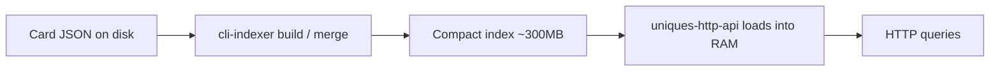

# Architecture overview

This document explains how **rust-cards-api** is built for someone who has never seen the repository. It focuses on the *why* and the *shape* of the system, not every CLI flag or API parameter.

For on-disk byte layouts and external consumers, see also [ALL_SETS index format](ALL_SETS-index-format.md) and the [HTTP API spec](api-spec.md).

---

## Motivation

[Altered TCG](https://www.altered.gg/) has a large catalog of **Unique** cards (alternate-art prints within a family). Players and deck builders often need to search that catalog with filters that are hard to express in a simple text search:

- **Abilities** — “cards whose main effect includes X as a trigger and Y as an output”
- **Stats** — hand cost, reserve cost, mountain/ocean/forest power
- **Faction**, set, and other structured properties

The goal of this project is a **fast search engine** over that Unique-card universe: answer complex filter queries in milliseconds, not seconds, without paying for a always-on database.

---

## Why not a SQL database?

A conventional approach would load card JSON into PostgreSQL (or similar), index `idGd` values and stats in relational tables, and run `JOIN` / `WHERE` queries.

That works, but for this workload it tends to be **slow and expensive**:

- Complex ability filters touch many rows and indexes; end-to-end latency is often on the order of **1–3 seconds**, if not more, for heavy queries.
- You need a managed database, which is often the expensive part in hosting.

This project instead **precomputes** everything needed to filter into a compact index, then loads it in-memory at startup and serves queries from **memory** from a small HTTP process.

---

## High-level approach

The pipeline has three main steps:



### 1. Build a compact index

The **`index-core`** library (invoked by the **`cli-indexer`** CLI) walks the Equinox-style Unique card dataset (one JSON file per card), extracts filter-relevant fields once, and writes a **read-optimized** binary index:

- No duplicate card JSON in the index
- Shared properties (e.g. “has ability 123”) are stored once as **bitmaps** over a global `card_index` space
- Per-card details are stored in a fixed-size **`cards.bin`** table for fast lookup by index.
- JSON catalogs record the redundant details that are common to many cards (Name, Artist, Subtypes, etc.). They also give general metadata for cardinality and ranges.

Using these catalogs, we can quickly reconstruct a `card_index` <-> `referenceID` (`ALT_CORE_B_AX_05_U_1234`) mapping. 

Per-set indexes can be **merged** into a single `ALL_SETS` universe (see [merge plan](../cli-indexer/plans/04-merge-indexes.md)).

### 2. Load the index in memory

The **`uniques-http-api`** service reads the index directory at startup into `AppState`: Roaring bitmap files, `cards.bin`, and small JSON catalogs. The merged index is on the order of **~300 MB** on disk, which fits comfortably in RAM on a small Cloud instance or any PC (possibly even mobile devices).

### 3. Answer queries with bitmap algebra

A request describes filters (effects, costs, factions, …). The server **intersects** the relevant prebuilt bitmaps to get matching `card_index` values, then **decodes** card details from `cards.bin` and the catalog only for the result set (or a page of it).

No query-time scan of the raw JSON tree.

---

## Advantages of this design

| Benefit | What it means |
|--------|----------------|
| **Fast** | Set operations on Roaring bitmaps are microseconds to low milliseconds. |
| **Cheap** | No external database. The server is a single binary plus static index files. |
| **Simple ops** | Deploy as a container (see [uniques-http-api README](../uniques-http-api/README.md)); scale to zero or run on-demand so you mostly pay for CPU during requests. |
| **Portable index** | The `ALL_SETS` folder is a versioned artifact: build offline, ship with the image or mount from object storage. |

---

## Why Rust?

Rust is a good fit for this kind of system:

- **Performance close to the metal** — predictable memory layout, no GC pauses during request handling.
- **Strong tooling for binary data** — fixed-size records, `u8`/`u16` packing, mmap-friendly layouts, and safe parsing of large byte buffers.
- **Ecosystem** — [roaring-rs](https://github.com/RoaringBitmap/roaring-rs) for bitmaps, Axum for the HTTP server, serde for the small JSON metadata files.

The indexer and API share types and logic via the **`index-core`** library crate; the HTTP service is a thin layer over that core.

---

## Repository map

| Component | Role |
|-----------|------|
| **`index-core/`** | Shared library: index types, build/merge/query logic, bitmaps, catalogs. |
| **`cli-indexer/`** | CLI: crawl JSON, build bitmaps, write `cards.bin`, merge sets, bench queries. |
| **`uniques-http-api/`** | Loads `ALL_SETS` (or a set index) and exposes REST endpoints. |
| **`demo-ui/`** | Optional React demo that calls the API (filters, card preview). |
| **`docs/`** | Architecture (this file) and index format specs. |

---

## The index: two complementary parts

Every card in the merged universe has a stable integer **`card_index`** from 0 … 5,455,927 (total number of uniques - 1). All filters ultimately produce a subset of those indices. The index splits “membership” from “payload”:

### 1. Roaring bitmaps — “which cards match this property?”

Many filters are **binary predicates** over the card universe:

- Card contains **ability / idGd** `123` (whole card or on a specific effect line: main 1–3 or echo)
- Card is **faction** AX
- Card has **main cost** 3, **mountain power** 5, etc.

For each distinct property value we store one **[Roaring bitmap](https://roaringbitmap.org/)**: a compressed set of `card_index` values. Roaring Bitmaps are data structures that splits the 32-bit integer space into 65,536-wide chunks and picks array, bitmap, or run containers per chunk, so **sparse** sets (typical for “cards with this rare ability”) stay small in memory while **dense** chunks stay fast for `AND` / `OR`.

**Why Roaring?**

- Far smaller than naive bitsets for sparse data
- Fast set operations (`&`, `|`, `-`) used to combine filters
- Standard on-disk `.roar` serialization shared across languages (not tested)

**Further reading**

- [Roaring Bitmaps](https://roaringbitmap.org/) — project overview and format spec  
- [roaring-rs](https://github.com/RoaringBitmap/roaring-rs) — Rust port used in this repo  
- [Introduction to Roaring Bitmap](https://www.baeldung.com/java-roaring-bitmap-intro) — If you want to understand all about the inner workings of this data structure

**On disk (merged index)** — under `ALL_SETS/`:

- `id_gd/<id>.roar` — cards that contain that idGd anywhere  
- `id_gd/<id>_m1.roar`, `_m2`, `_m3`, `_ec` — same, restricted to a main or echo effect line  
- `stats/<field>/<00..15>.roar` — stat buckets (costs and powers 0–15)  
- `factions/<FACTION>.roar` — one file per faction code  

`catalog.json` maps `card_index` back to the card reference string (`ALT_COREKS_B_AX_06_U_5`, …). See [ALL_SETS index format](ALL_SETS-index-format.md) for the full layout.

**Query intuition:** “Main cost 3 **and** faction AX **and** has idGd 42 (on any ability)” becomes something like:

```text
stats/main_cost/03.roar  &  factions/AX.roar  &  id_gd/42.roar  →  result bitmap
```

The HTTP layer adds rules for multi-idGd effect slots (trigger / condition / output groups); the core remains bitmap intersection.

### 2. `cards.bin` — compact per-card ability payload

Bitmaps answer **which** cards match; they do not store full effect text or arbitrary fields. For each `card_index` there is one **fixed-size binary record** (32 bytes) in **`cards.bin`**:

- Faction tag, main/recall cost, three power stats  
- Packed **idGd** triplets for up to three main-effect groups and one echo group (trigger / condition / output per group)

Because every record is the same size:

```text
offset = card_index × 32
```

the server can jump directly into the byte slice without parsing JSON or walking variable-length structures.

**Design and layout** are documented in the indexer plan:

- [idGd compact card format (`cards.bin`)](../cli-indexer/plans/02-idgd-compact-card-format.md)

Implementation: `index_core::compact` (`CompactCardView`, `RECORD_SIZE`).

Human-readable effect strings are resolved at query time via `idgd_catalog.json` (id → text), not duplicated in every card row.

---

## End-to-end query flow (simplified)

1. Client sends filter parameters (e.g. `GET /api/v2/cards?...`).
2. Server loads or reuses preloaded `RoaringBitmap`s for each predicate.
3. Bitmaps are combined (`&`, unions within effect groups, etc.) → matching `card_index` set.
4. For each index in the page, decode reference from `catalog`, stats/effects from `cards.bin`, attach display text from catalogs.
5. Return JSON (`CardsResponse`).

Benchmarks in `cli-indexer bench-query` time query intersection and optional card decode with everything already in RAM; see [bench-query plans](../cli-indexer/plans/05-bench-query.md) and [select profiling](../cli-indexer/plans/12-bench-query-select-profiling.md).

---

## Related documentation

| Topic | Document |
|-------|----------|
| CLI commands & flags | [cli-reference.md](cli-reference.md) |
| Index byte layout & merge semantics | [ALL_SETS-index-format.md](ALL_SETS-index-format.md) |
| Bitmap indexer design | [01-idgd-bitset-indexer.md](../cli-indexer/plans/01-idgd-bitset-indexer.md) |
| `cards.bin` record layout | [02-idgd-compact-card-format.md](../cli-indexer/plans/02-idgd-compact-card-format.md) |
| HTTP API | [api-spec.md](api-spec.md) |
| Deploy / Cloud Run | [uniques-http-api README](../uniques-http-api/README.md) |
