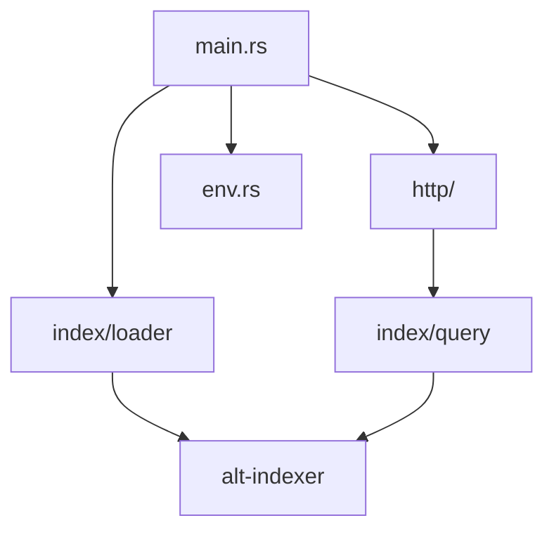

# Architecture

This document describes how **uniques-http-api** is structured.

### Index on disk

Production and local dev use the merged index at `alt-indexer/full_index/ALL_SETS` (see repo `AGENTS.md`). It combines all sets (`CORE`, `COREKS`, `ALIZE`, …) into one global bit space.

At startup, `INDEX_PATH` (default in `.env.local`: `./alt-indexer/full_index/ALL_SETS`) points at that directory. The loader reads every referenced file into memory once; then responds to requests only from the data loaded into memory.

## Overview

The crate splits into two top-level modules: **`index/`** (load and query the on-disk index) and **`http/`** (Axum routes, request parsing, JSON responses). Both depend on the **`alt-indexer`** library for shared index types.

Arrows point from a module **toward what it depends on** (deeper in the diagram).



## Source layout (`uniques-http-api/src`)

Rust modules follow the **no `mod.rs`** convention: a parent file (e.g. `http.rs`) declares child modules in a sibling directory (e.g. `http/`).

```
src/
  lib.rs              Crate root: re-exports public surface
  main.rs             Binary entrypoint
  env.rs              .env / .env.local loading

  index.rs            Index domain module root
  index/
    loader.rs         Read index directory → UniquesIndex + AppState
    uniques_index.rs  In-memory index (UniquesIndex, CardResolveError)
    query.rs          Query submodule root
    query/
      cards.rs        Bitmap filtering, card assembly, paging
      error.rs        QueryError

  http.rs             HTTP / Axum module root
  http/
    state.rs          AppState (Axum shared state wrapper)
    admin.rs          /healthz
    admin/handlers.rs
    api.rs            Merges cards + effects API routers
    api/
      error.rs        ApiError, HTTP status mapping
      cards.rs        Cards router
      cards/
        handlers.rs   Thin Axum handlers
        models.rs     Request/response types (CardV2, CardsRequest, …)
        parse.rs      Query string → CardsRequest
        test_support.rs  Shared test fixtures (cfg(test))
      effects.rs      Effects router
      effects/
        handlers.rs
        models.rs
        list.rs       Build memoized effects catalog JSON
        filtered.rs   Same-line co-occurrence logic for /effects/filtered
```

## Layer responsibilities

### `env`

Loads optional `.env` then `.env.local` from the crate directory. No other logic.

### `index` — domain layer

Everything that understands the on-disk index format and how to query it. **Does not** know about HTTP status codes or Axum extractors (except where the loader pre-serializes the effects JSON body using Axum's `Bytes` type).

| Module | Responsibility |
|--------|----------------|
| **`index/loader`** | Walk `INDEX_PATH`: load `catalog.json`, summaries, `cards.bin`, `.roar` bitmaps. Build derived indexes (set bitmaps, name search, family lookup/span groups). Construct `UniquesIndex` and return `AppState`. Public entry: `load_index`. |
| **`index/uniques_index`** | `UniquesIndex` — owned, read-only in-memory index. Accessors for catalog, bitmaps, stats, factions, etc. `card_view`, `decode_reference`, `resolve_card_index` (+ `CardResolveError`). |
| **`index/query/cards`** | Given a parsed `CardsRequest` and `&UniquesIndex`, intersect roaring bitmaps (effects, support, faction, set, cost, name), page results, assemble `CardV2` JSON structs. |
| **`index/query/error`** | `QueryError` for internal query failures (e.g. missing stats bucket). Mapped to HTTP 400 in the API layer. |

### `http` — transport layer

Axum routing, shared state, and HTTP-specific concerns.

| Module | Responsibility |
|--------|----------------|
| **`http/state`** | `AppState { index: UniquesIndex }` — container for Axum `State`. Will gain additional HTTP-layer fields over time. Exposes `index()`. |
| **`http/admin`** | Operational routes (`GET /healthz`). |
| **`http/api/error`** | `ApiError` JSON body, `bad_request` / `not_found`, `map_query_error`. |
| **`http/api/cards/models`** | API types: `CardV2`, `CardsResponse`, `CardsRequest`, filter enums. Owned by the cards API, consumed by parse, query, and handlers. |
| **`http/api/cards/parse`** | Parse query strings into `CardsRequest`. Validates idGd types, sets, factions, costs. Returns `ApiResult` (400 on bad input). |
| **`http/api/cards/handlers`** | Wire parse → query → JSON response. Map `CardResolveError` to 400/404. |
| **`http/api/effects/list`** | Build grouped effects list from `IdGdCatalog` (used at load time and in tests). |
| **`http/api/effects/filtered`** | Bitmap logic for `GET /api/v2/effects/filtered` (same-line co-occurrence with edited slot removed). |
| **`http/api/effects/handlers`** | Serve memoized effects JSON; run filtered effects endpoint. |

## Dependency rules

**Preferred pattern for new code:**

- Index types and operations → `index/`
- HTTP routes, parsing query strings, response shapes → `http/api/…`
- Handlers stay thin: parse input, call `index`, map errors, return JSON

## Cards endpoint pipeline

Example for `GET /api/v2/cards?effect[0][t]=24&limit=10`:

1. **`handlers::get_cards_v2`** — extract `RawQuery`, get `&UniquesIndex` from `state.index()`
2. **`parse::parse_request`** — build `CardsRequest` (limit, filters, factions, …)
3. **`query::build_bitmap`** — intersect roaring bitmaps → matching card indices
4. **`query::page_cards_v2`** — walk bitmap with cursor/limit, build `Vec<CardV2>`
5. **Handler** — wrap in `CardsResponse`, serialize JSON
Single-card lookup (`GET /api/v2/card/{reference}`) uses `UniquesIndex::resolve_card_index` then `card_v2_from_index`.

## Testing

| Location | Purpose |
|----------|---------|
| `tests/` | Integration tests against `app()` + minimal fixture index (`tests/fixtures/minimal_index/`) |
| `index/query/cards` tests | Query logic with `http/api/cards/test_support` fixtures |
| `http/api/cards/parse` tests | Query-string parsing and validation |
| `index/loader` tests | Family lookup, name normalization, span groups |

## Related docs

- [API spec](../../docs/api-spec.md) — endpoint contracts
- [Crate README](../README.md) — run locally, Docker, Cloud Run
- [plans/](../plans/) — incremental design notes from feature work
- Repo [AGENTS.md](../../AGENTS.md) — index directory layout and card counts
