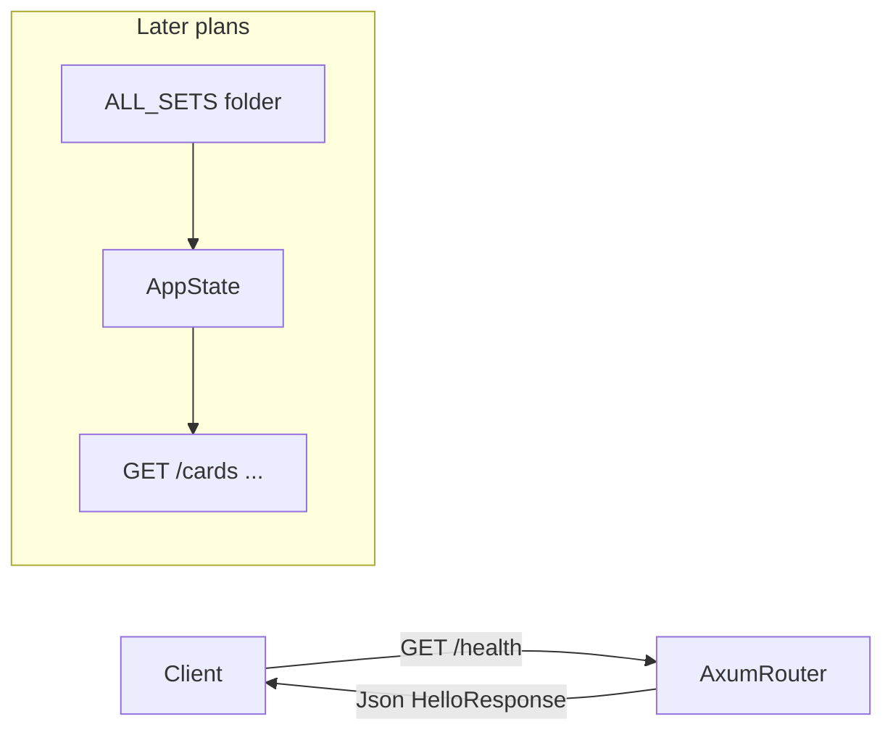

# Plan 01: Hello World HTTP server

## Goal

Bootstrap `uniques-http-api` as a minimal Axum + Tokio HTTP service with a liveness endpoint, as the foundation for later endpoints that serve cards from on-disk `ALL_SETS` indexes ([`docs/ALL_SETS-index-format.md`](../../docs/ALL_SETS-index-format.md)).

## Context

- [`uniques-http-api/Cargo.toml`](../Cargo.toml) already declares **axum 0.8**, **tokio**, **serde** / **serde_json**, plus sqlx/dotenv for later phases.
- The crate is standalone (no workspace root `Cargo.toml`); run with `cargo run` from `uniques-http-api/`.
- Index build/query logic lives in [`alt-indexer`](../../alt-indexer); this API will eventually read merged indexes without requiring the full query CLI. **Out of scope for plan 01.**



## Design

| Choice   | Decision |
| -------- | -------- |
| Route    | `GET /health` — liveness probe; `/` alias can be added later |
| Response | JSON via `axum::Json` + `serde::Serialize`: `{"message":"Hello World"}` |
| Bind     | `0.0.0.0:8234` (stable local/dev URL) |

Router and handler live in [`src/lib.rs`](../src/lib.rs) (`app()`, `health()`); [`src/main.rs`](../src/main.rs) only binds and serves so integration tests can import the library.

## Implementation

### Router and handler

```rust
#[derive(Serialize)]
pub struct HelloResponse {
    pub message: &'static str,
}

pub async fn health() -> Json<HelloResponse> {
    Json(HelloResponse { message: "Hello World" })
}

pub fn app() -> Router {
    Router::new().route("/health", get(health))
}
```

### Server entrypoint

- `TcpListener::bind("0.0.0.0:8234")`
- `axum::serve(listener, app())`
- Log `Server started successfully at 0.0.0.0:8234` on startup

No `rust_crud_api`, sqlx, dotenv, or `Arc` in this plan; those dependencies remain in `Cargo.toml` for later work.

### Integration test

[`tests/health.rs`](../tests/health.rs): build `app()`, call `/health` with `tower::ServiceExt::oneshot`, assert status `200` and body `{"message":"Hello World"}`.

## Verification

From `uniques-http-api/`:

```bash
cargo build
cargo test
cargo run
```

Then:

```bash
curl http://127.0.0.1:8234/health
# expected: {"message":"Hello World"}
```

## Deferred (later plans)

- Load `catalog.json` / `cards.bin` from an `ALL_SETS` directory (e.g. env var `INDEX_PATH`).
- Share or extract index-reading code from `alt-indexer`.
- sqlx/postgres, dotenv, and card query routes.
- Root workspace membership.

## Files

| File | Role |
| ---- | ---- |
| [`src/lib.rs`](../src/lib.rs) | Router, `HelloResponse`, `GET /health` |
| [`src/main.rs`](../src/main.rs) | Bind and serve |
| [`tests/health.rs`](../tests/health.rs) | Integration test |

## Success criteria

- [x] `cargo build` succeeds in `uniques-http-api/`.
- [x] `cargo test` passes.
- [x] `GET http://127.0.0.1:8234/health` returns `200` with `Content-Type: application/json` and body `{"message":"Hello World"}`.
