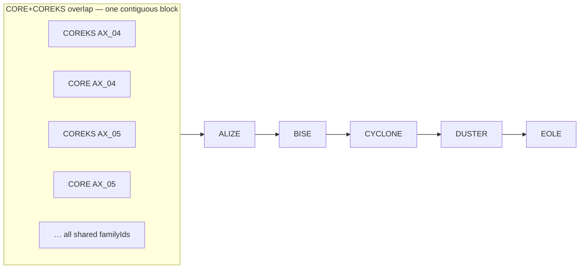

## Plan 08: `GET /api/v2/cards` — support `set[]` filtering

### Goal

Implement search filters by **source set code** (`CORE`, `COREKS`, `ALIZE`, …) for the merged `ALL_SETS` index:

- No parameter → search the whole universe (unchanged).
- One or more `set[]` values → restrict to the union of those sets (OR within sets, AND with other filters).

Bitmaps are derived from `catalog.json` at load (no on-disk `sets/*.roar` in the indexer). A precomputed `CORE | COREKS` bitmap optimizes the common case where both overlap-group sets are selected.

**Status:** implemented.

### Design

Treat sets like factions: one Roaring bitmap per source set, built once at startup from `catalog.families`, combined with `&=` in `build_bitmap`.

**Optimization:** also precompute `CORE | COREKS` at load (`a | b` after the per-set loop). Most queries are expected to filter on **both** or **neither**; when the request includes both, use the combined bitmap directly (one clone, no runtime `|=` between them). Per-set bitmaps remain for single-set filters and arbitrary multi-set combinations.

Set bitmaps are dense unions of runs (one run per family span). Roaring compresses these well; intersecting a sparse idGd result with a dense set bitmap is a standard fast path.

#### Memory

- Every `card_index` belongs to exactly one catalog family row, hence one `source_set`.
- Each set bitmap unions that set’s family spans; expect on the order of a few MB total for ~10–20 sets, plus one extra bitmap for `CORE | COREKS`.

#### Index layout in `card_index` space

Merged ordering ([`04-merge-indexes.md`](../../alt-indexer/plans/04-merge-indexes.md)): overlap groups form **one contiguous block** each; non-overlapping sets are whole-set blocks in `--sets` order. Within the CORE+COREKS overlap group, families are sorted by `family_id`, then **source_set order from `--sets`** per family (repo merge: `COREKS,CORE,ALIZE,BISE,CYCLONE,DUSTER,EOLE`).



Each labeled slice is one catalog **family row**: a contiguous `[start_bit, start_bit + max_unique_id)` span. A per-set bitmap (e.g. CORE only) unions every slice whose `source_set` matches, so CORE’s bits are **non-contiguous** inside the overlap block but the overlap block itself is contiguous on the axis. The precomputed `CORE | COREKS` bitmap covers the **entire** overlap block (equivalent to OR-ing those two per-set maps).

### API semantics

Filter by **source set codes** (not product codes like `BTG`).

| Param | Behavior |
|-------|----------|
| omitted | No set constraint |
| `set[]=CORE&set[]=COREKS` | OR within listed sets (uses combined bitmap when both present) |
| `set=CORE,COREKS` | CSV alias (same pattern as `faction=`) |
| unknown code | `400` |

Document in [`docs/api-spec.md`](../docs/api-spec.md).

### Implementation outline

#### 1) Build set bitmaps at load

File: [`src/loader.rs`](../src/loader.rs)

```rust
pub const SET_CORE: &str = "CORE";
pub const SET_COREKS: &str = "COREKS";

pub struct SetBitmaps {
    pub by_set: BTreeMap<String, RoaringBitmap>,
    pub core_and_coreks: Option<RoaringBitmap>,
}

pub fn build_set_bitmaps(catalog: &Catalog) -> SetBitmaps { ... }
```

- Loop `catalog.families`: `insert_range(start_bit..start_bit + max_unique_id)` into `by_set[source_set]` (or `catalog.set` when `source_set` is absent).
- After the loop: `core_and_coreks = Some(CORE | COREKS)` when both keys exist.
- Log set count + whether combined bitmap was built.
- Store on [`AppStateInner`](../src/state.rs); expose `AppState::set_bitmaps()`.

#### 2) Parse query params

File: [`src/cards.rs`](../src/cards.rs)

- `sets: Vec<String>` on `CardsRequest`.
- `parse_sets` — `set[]` repeated keys + `set` CSV alias, dedupe.
- Validate each code against `set_bitmaps().by_set` keys → `invalid set value '…'`.

#### 3) Integrate into `build_bitmap`

`union_requested_sets(bitmaps, sets)`:

| Requested sets | Bitmap used |
|----------------|-------------|
| empty | (caller skips — no set group) |
| includes both CORE and COREKS | start from `core_and_coreks` (fallback: OR singles); **do not** also OR `by_set["CORE"]` and `by_set["COREKS"]` |
| includes both plus other sets | combined, then OR each other requested set |
| otherwise | OR each requested set from `by_set` |

```rust
if !req.sets.is_empty() {
    groups.push(union_requested_sets(state.set_bitmaps(), &req.sets));
}
```

Allows **set-only** queries (no ability/cost filters required).

### Verification

File: [`src/cards.rs`](../src/cards.rs) unit tests:

- Parse `set[]` / CSV alias
- Invalid set => 400
- Mock catalog with CORE + COREKS + ALIZE: combined equals manual `CORE | COREKS`
- `set[]=CORE&set[]=COREKS` cardinality matches combined bitmap
- Single-set and three-set OR behavior
- Set-only query without other filters

Run: `cargo test` in `uniques-http-api`.

### Out of scope

- Indexer `sets/*.roar` on disk (catalog-derived bitmaps are enough for HTTP).
- Product codes (`BTG`) as filter values.
- Other pairwise combined bitmaps unless profiling shows another hot pair.
- Demo UI: set checkboxes in `demo-ui/src/components/FilterPanel.tsx` (below Factions).

### Dependencies

- Prior plans: [02-load-index-appstate](02-load-index-appstate.md), [05-faction-and-cost-filtering](05-faction-and-cost-filtering.md).
- Merge layout: [`alt-indexer/plans/04-merge-indexes.md`](../../alt-indexer/plans/04-merge-indexes.md).
