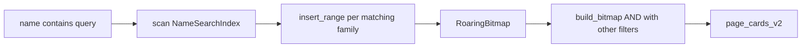

## Plan 09: `GET /api/v2/cards` — search by character name

### Goal

Implement a `name` filter on character name (catalog `family.name`):

- No parameter → no name constraint (unchanged).
- Non-empty `name` → case-insensitive **substring** match across **all locales**; AND with other filters.
- Whitespace-only `name` → treated as omitted (no filter).

Bitmaps are built **on the fly** per request: scan matching catalog family rows, `insert_range` for each family span. Pre-computing per-family Roaring bitmaps is not required — families are contiguous and there are only ~527 catalog rows in `ALL_SETS`.

**Status:** implemented.

### Design

Character name is shared by all variants in a catalog **family row** (`FamilyEntry`). Each row owns a contiguous bit span `[start_bit, start_bit + max_unique_id)` in `card_index` space — same span semantics as [set filters](08-set-filters.md).




#### Name search index at load

At startup, build a `NameSearchIndex` from `catalog.families`: for each family row, store all locale names normalized once (lowercase + strip combining diacritics via Unicode NFD). Query-time search scans this cache; the user’s `name` parameter is normalized the same way.

Pre-computing per-family Roaring bitmaps is **not** used — substring search still requires scanning all family names, and `insert_range` into one bitmap is cheaper than OR-ing many pre-built bitmaps.

#### Scale (ALL_SETS merged index)


| Metric              | Value     |
| ------------------- | --------- |
| Catalog family rows | ~527      |
| Unique `family_id`s | ~418      |
| `total_bit_span`    | ~5.4M     |
| Avg family span     | ~10k bits |


Name scan cost is sub-millisecond; bitmap construction from a handful of runs is negligible compared to JSON serialization.

#### Merged-index behavior

The same `family_id` can appear in multiple sets as separate catalog rows (e.g. CORE and COREKS). Name search ORs all matching rows — e.g. `name=Kelon` returns both sets’ variants unless `set[]` narrows the result.

### API semantics


| Param                      | Behavior                                                        |
| -------------------------- | --------------------------------------------------------------- |
| omitted                    | No name constraint                                              |
| `name=Kelon`               | Case-insensitive substring match on any locale in `family.name`; diacritics folded (`elementaire` matches `Élémentaire`) |
| `name=` or whitespace only | No name constraint                                              |
| no match                   | Empty result set (`total: 0`)                                   |


Document in `[docs/api-spec.md](../../docs/api-spec.md)`.

### Implementation outline

#### 1) Build name search index at load

File: `[src/loader.rs](../src/loader.rs)`

```rust
pub struct NameSearchIndex {
    by_family: Vec<Vec<String>>, // lowercased locale names per catalog row
}

pub fn build_name_search_index(catalog: &Catalog) -> NameSearchIndex { ... }
```

- Built alongside `build_set_bitmaps` in `load_index`.
- Stored on `[AppStateInner](../src/state.rs)`; exposed as `AppState::name_search_index()`.

#### 2) Parse query param

File: `[src/cards.rs](../src/cards.rs)`

- `name: Option<String>` on `CardsRequest`.
- `parse_name`: read `name`, trim; return `None` if empty after trim.

#### 3) Build name bitmap

File: `[src/cards.rs](../src/cards.rs)`

```rust
fn bitmap_for_name_contains(
    catalog: &Catalog,
    index: &NameSearchIndex,
    query: &str,
) -> RoaringBitmap { ... }
```

- Zip `catalog.families` with `index.by_family()`.
- On match: `insert_range(start_bit..start_bit + max_unique_id)`.
- Use `max_unique_id` (not `card_count`).

#### 4) Integrate into `build_bitmap`

```rust
if let Some(name) = &req.name {
    groups.push(bitmap_for_name_contains(
        state.catalog(),
        state.name_search_index(),
        name,
    ));
}
```

Allows **name-only** queries (no effect/cost filters required).

#### 5) Demo UI

File: `[demo-ui/src/components/FilterPanel.tsx](../../demo-ui/src/components/FilterPanel.tsx)`

- Text field for character name above Factions.
- Wire through `FilterState`, `buildQuery.ts`.

### Verification

File: `[src/cards.rs](../src/cards.rs)` unit tests:

- Empty / whitespace `name` → no filter
- Case-insensitive contains
- Match via non-`en_US` locale
- Diacritic folding (`elementaire` matches `Élémentaire de Kélon`)
- No match → empty bitmap
- Name-only query
- Name AND `set[]`

Run: `cargo test` in `uniques-http-api`.

### Out of scope

- Prefix-only / exact match modes
- Fuzzy or trigram search
- Searching subtype names or artist
- Pre-computed per-family Roaring bitmaps on disk

### Dependencies

- Prior plans: [02-load-index-appstate](02-load-index-appstate.md), [08-set-filters](08-set-filters.md).
- Catalog layout: `[alt-indexer/src/catalog.rs](../../alt-indexer/src/catalog.rs)`.

