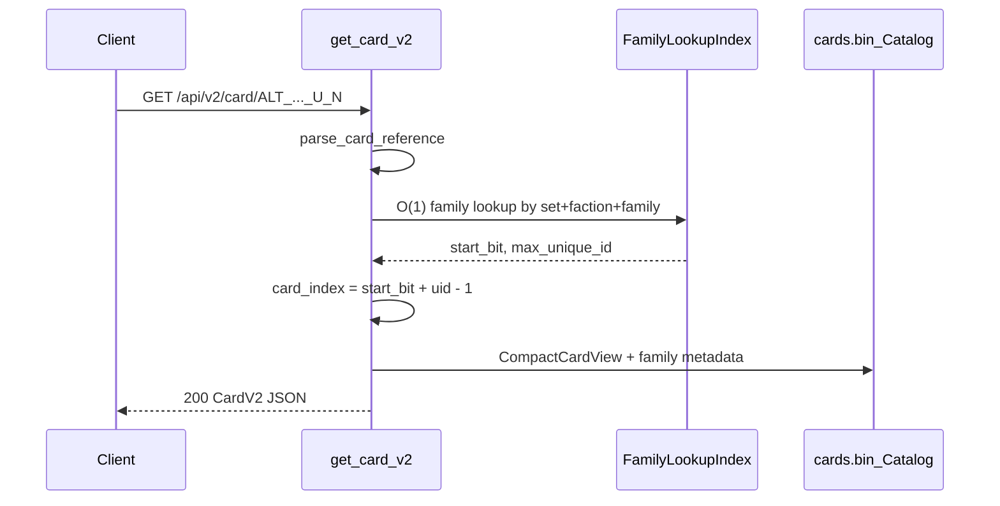

## Plan 10: `GET /api/v2/card/{reference}`

### Goal

Expose a single-card lookup endpoint:

```
GET /api/v2/card/ALT_CYCLONE_B_BR_77_U_1787
```

Response body is a **direct `CardV2` object** (same fields as one element of [`GET /api/v2/cards`](../../docs/api-spec.md) `cards[]`), not wrapped in `iter` / `cards`.

**Status:** implemented.

### Request flow



### Fast lookup strategy

**CLI today:** `alt-indexer query --refid` already resolves references via [`Catalog::lookup_bit`](../../alt-indexer/src/catalog.rs), which scans up to **527** family rows per lookup ([alt-indexer plan 09](../../alt-indexer/plans/09-query-refid.md)). That cost was acceptable for a one-off CLI call and did not need optimization.

**HTTP:** A **`FamilyLookupIndex`** with **527 entries** (one per `catalog.families` row on the merged `ALL_SETS` index). `card_index` is computed by arithmetic (same rule as `lookup_bit`):

```
card_index = family.start_bit + unique_id - 1
```

| Aspect | Detail |
|--------|--------|
| Parse | `alt_indexer::path::parse_card_reference` → `set`, `faction`, `family_number`, `unique_id` |
| Index key | `(set, faction, family_number)` — `HashMap<FamilyKey, FamilySpan>` where `FamilyKey` mirrors `lookup_bit` matching (`source_set` or catalog `set`) |
| Index value | `FamilySpan { start_bit, max_unique_id }` |
| Build | In [`build_family_lookup_index`](../src/loader.rs): one insert per `FamilyEntry` in `catalog.families` |
| Index size | **527** entries for production `ALL_SETS` ([`manifest.json`](../../alt-indexer/full_index/ALL_SETS/manifest.json) `family_count`; verified `catalog.families.len() == 527`). Test fixture [`minimal_index`](../tests/fixtures/minimal_index): **1** entry. |
| Request path | O(1) family lookup → bounds check `unique_id <= max_unique_id` → `card_index = start_bit + unique_id - 1` |

Store on [`AppStateInner`](../src/state.rs) and expose **`AppState::resolve_card_index(reference: &str) -> Result<u32, CardResolveError>`** (parses the reference string internally; returns `BadRequest` or `NotFound` for the handler to map to 400/404).

**Bounds and padding** (same as `lookup_bit`):

- Unknown family key → **404**
- `unique_id > max_unique_id` → **404** (padding slot in family span; error message includes max UniqueID via `FamilyLookupIndex::max_unique_id`)

**Validation after `card_index` is computed** (mirror [`query_refid_effect_text`](../../alt-indexer/src/query.rs)):

1. `card_view(card_index)` must succeed.
2. Reject “not indexed” compact slots: `faction_code == 0` → **404**

Invalid reference syntax → **400** via `parse_card_reference`. Other failures → **404** with `{ "error": "..." }` ([`ApiError`](../src/cards.rs)).

### Reuse search response building

[`page_cards_v2`](../src/cards.rs) previously inlined `CardV2` construction. Refactored to a shared helper (callers build the idGd map once per request/page):

```rust
fn card_v2_from_index(
    state: &AppState,
    card_index: u32,
    idgd_by_id: &BTreeMap<u32, &IdGdCatalogEntry>,
    debug_bga_trigram: bool,
) -> ApiResult<CardV2>
```

- `page_cards_v2` builds `idgd_by_id` once, then calls this in its bitmap loop.
- `get_card_v2` builds `idgd_by_id` once, then calls it after lookup.

No new serialization types; same `CardV2` / `CardSetV2` / effect localization helpers (`build_main_effect_localized`, etc.).

### Routing and handler

In [`lib.rs`](../src/lib.rs):

```rust
.route("/api/v2/card/{reference}", get(cards::get_card_v2))
```

Handler in [`cards.rs`](../src/cards.rs):

```rust
pub async fn get_card_v2(
    State(state): State<Arc<AppState>>,
    Path(reference): Path<String>,
    RawQuery(query): RawQuery,
) -> ApiResult<Json<CardV2>>
```

- Path param is the full reference string (underscores are fine; no slashes).
- Optional `?debug_bga_trigram` (same flag behavior as [`get_cards_v2`](../src/cards.rs)); **documented** in [`api-spec.md`](../../docs/api-spec.md).

### Loader integration

In [`load_index`](../src/loader.rs), after catalog load:

```rust
let family_lookup_index = build_family_lookup_index(&catalog);
eprintln!("  family lookup index: {} families", family_lookup_index.len());
```

Wire into `AppStateInner` construction (alongside `name_search_index`).

### Documentation

Section added to [`docs/api-spec.md`](../../docs/api-spec.md):

- **Route:** `GET /api/v2/card/{reference}`
- **200:** one `CardV2` object (same example fields as search response card object)
- **400:** malformed reference (does not match `ALT_<SET>_B_<faction>_<family>_U_<uid>`)
- **404:** unknown reference or slot not indexed

### Tests

1. **Integration** — [`tests/card_by_reference.rs`](../tests/card_by_reference.rs) using [`minimal_index`](../tests/fixtures/minimal_index):
   - `GET /api/v2/card/ALT_TEST_B_AX_04_U_1` → 200, fields match fixture catalog (`name.en_US`, `set.code`, etc.)
   - `GET /api/v2/card/not-a-ref` → 400
   - `GET /api/v2/card/ALT_TEST_B_AX_99_U_1` → 404 (unknown family)
   - **Fixture note:** [`minimal_index/cards.bin`](../tests/fixtures/minimal_index/cards.bin) must contain a non-zero `faction_code` compact record at bit 0; an all-zero record correctly returns 404 (“not indexed”).
2. **Unit** — in [`loader.rs`](../src/loader.rs) `#[cfg(test)]`:
   - `build_family_lookup_index` has exactly `catalog.families.len()` entries
   - resolve for `ALT_TEST_B_AX_04_U_2` yields `card_index == 1` when `start_bit == 0`
   - `unique_id > max_unique_id` returns `FamilyResolveError::Padding`
   - `card_v2_from_index` still covered indirectly via existing paging tests in `cards.rs` after refactor
3. **Load** — [`load_index.rs`](../tests/load_index.rs) asserts `family_lookup_index().len() == catalog().families.len()`.

Update all `AppStateInner` test constructors in [`cards.rs`](../src/cards.rs) with `family_lookup_index: build_family_lookup_index(&catalog)`.

### Demo UI

Add a **Card reference** field in [`FilterPanel.tsx`](../../demo-ui/src/components/FilterPanel.tsx), placed **above** the existing “Character name” input. Uses the same **300ms debounce** as other filters in [`useCardsQuery`](../../demo-ui/src/hooks/useCardsQuery.ts) (via `serializeFilters`).

#### State and wiring

- Add `reference: string` to [`FilterState`](../../demo-ui/src/types.ts) and [`DEFAULT_FILTER_STATE`](../../demo-ui/src/types.ts) (`reference: ''`).
- Include `reference` in [`serializeFilters`](../../demo-ui/src/hooks/useCardsQuery.ts) so changes re-run the debounced effect.
- **Clear filters** resets `reference` with the rest of `DEFAULT_FILTER_STATE`.
- No separate `lookupByReference` callback or Enter handler — controlled input only (`value` / `onChange` like `name`).

#### Debounced fetch branching (`useCardsQuery`)

Inside the existing debounced `useEffect`:

| `reference.trim()` | Request |
|--------------------|---------|
| non-empty | `GET` via [`buildCardByReferenceUrl`](../../demo-ui/src/api/buildQuery.ts) → `/api/v2/card/${encodeURIComponent(ref)}` (+ optional `?debug_bga_trigram`). **Do not** call `/api/v2/cards`; other filters are ignored while reference is set (cost-validation path in `buildFullUrl` is skipped). |
| empty or whitespace only | Existing `/api/v2/cards` path via `buildFullUrl` (unchanged). |

On reference fetch:

1. Abort in-flight list / load-more requests (same as today).
2. `status: 'loading'`, clear `cards` before response (grid clears while typing debounces).
3. Parse **direct** `CardV2` JSON (not `{ cards, iter }`).
4. On success: `cards: [card]`, `iter: { total: 1 }` (no `cursor` → load-more off).
5. Set `url` to the full fetch URL; set `queryString` to [`buildCardByReferencePath`](../../demo-ui/src/api/buildQuery.ts) (path + query only, no API base).
6. On 400/404: `status: 'error'`, `cards: []`, API `error` message.

Clearing the reference field (after debounce) switches back to the normal multi-card search with current filters.

`loadMore` is a no-op while `reference` is non-empty (`hasMore` requires empty reference and a cursor).

#### Query preview

[`QueryPreview.tsx`](../../demo-ui/src/components/QueryPreview.tsx) normally renders `queryString` as `/api/v2/cards?{queryString}`. For card lookup, `queryString` holds a **full path** (`/api/v2/card/...`). **Implemented:** if `queryString` starts with `/api/v2/card/`, display it as-is (avoids `/api/v2/cards?/api/v2/card/...`).

Copy URL still uses the full `url` from `buildCardByReferenceUrl`.

#### API helpers

In [`buildQuery.ts`](../../demo-ui/src/api/buildQuery.ts):

```ts
export function buildCardByReferencePath(
  reference: string,
  options?: { debugBgaTrigram?: boolean },
): string

export function buildCardByReferenceUrl(
  reference: string,
  options?: { debugBgaTrigram?: boolean },
): string
```

`buildCardByReferenceUrl` prefixes `getApiBaseUrl()` when configured.

#### UX copy

- Label: **Card reference**
- Placeholder: e.g. `ALT_CYCLONE_B_BR_77_U_1787`

Reuse existing [`CardList`](../../demo-ui/src/components/CardList.tsx) — one card renders like any search hit; no new grid component.

### Out of scope

- Persisting the family index to disk (small in-memory map is enough)
- Changing `alt-indexer` catalog format

### Scale (ALL_SETS merged index)

| Metric | Value |
|--------|-------|
| `FamilyLookupIndex` entries | **527** (= `catalog.families.len()`, `manifest.family_count`) |
| Lookup per request (HTTP) | O(1) map + integer add |

Same `card_index` formula as the CLI; the HTTP server precomputes the family map so hot-path lookups avoid repeating the scan `lookup_bit` performs on each `--refid` invocation, which is O(527).
