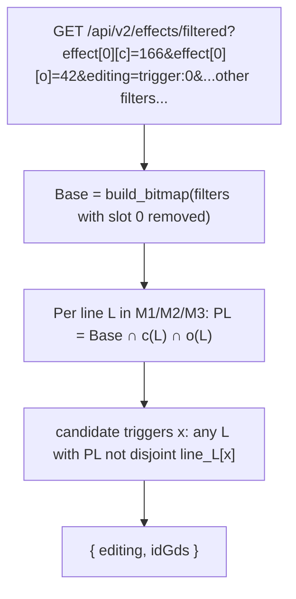

# Plan 11: Per-slot effects faceting (`/api/v2/effects/filtered`)

## Goal

Add a dedicated endpoint for per-combobox autocomplete narrowing. When the user is editing one
effect combobox, return only the idGds for that box that would still yield an ability that actually
exists, given the other boxes already set in that same group plus the rest of the current filters.
Presence-only, ids-only. Target latency: a few ms (well under 100 ms).

The existing static [`GET /api/v2/effects`](../docs/api-spec.md) (all triggers/conditions/outputs
with localized text) stays as-is and is used for the initial combobox population; the new endpoint
only narrows one box. No `alt-indexer` changes.

## Mental model

An effect group (one main-effect slot, or the support/echo slot) is a single ability: its
trigger/condition/output co-occur on the **same line**. The demo-ui already models this — `state.effects`
is an array of main groups and there is one `support` group; see
[`EffectSlotFields`](../../demo-ui/src/components/EffectSlotFields.tsx) and the compaction to
`effect[0]`, `effect[1]`, ... in [`buildQuery.ts`](../../demo-ui/src/api/buildQuery.ts).

Narrowing the trigger box of a group means: which triggers exist on the **same line** as the
condition/output already chosen in that group, within the current reduced search space? We do **not**
pin to a specific line index (M1/M2/M3) — we search across the group's lines and OR the results.

## Endpoint

`GET /api/v2/effects/filtered`

The client sends its **full current filter state** exactly as it would to `/api/v2/cards`
(`effect[N][...]`, `support[...]`, `faction`, `set`, `mainCost`/`recallCost`, `name`, `effectMode`) —
**including the group being edited** — plus one extra param:

- `editing` (required): `<part>:<slot>` identifying the box being edited.
  - `part` = `trigger` | `condition` | `output`.
  - `slot` = a main-effect slot index (`0`, `1`, ... matching the compacted `effect[N]` indices the
    client already builds) or the literal `support` for the echo/support group.
  - Examples: `editing=trigger:0`, `editing=condition:1`, `editing=output:support`.

The slot index pinpoints the group, so the server can exclude exactly that group from the search
space and read its other two boxes as co-constraints (see Semantics). If `slot` refers to a group
that is not present in the filters (a brand-new, still-empty group), there are simply no
co-constraints and nothing to exclude — the endpoint narrows by the remaining filters only.

Response (ids only; client already has text from its initial `/api/v2/effects` load):

```
{ "editing": "trigger:0", "idGds": [1, 5, 24, ...] }
```

## Why this is cheap

Everything needed is already in RAM (see [`src/state.rs`](../src/state.rs)):

- `id_gd_per_line: BTreeMap<(u32, EffectLine), RoaringBitmap>` (M1/M2/M3/Ec) — ~45 MB.
- Only **818** distinct effect parts total, split across T/C/O, so one box has a few hundred
  candidates. Cost = (candidates of that part) x (1-3 lines) short-circuiting `is_disjoint` calls
  -> ~1-2 ms, independent of result-set size (up to 5.4M cards). **Zero extra memory, no new
  precomputed bitmaps.**

## Semantics (same-line within the group, never-zero for AND)

Reuse the filter pipeline in [`src/cards.rs`](../src/cards.rs): `parse_request` -> `build_bitmap`,
plus per-line helpers `bitmap_intersect_buckets_on_line` / `bitmap_line_any_ids` / `bitmap_line`
(lines 808-859).

Parse `editing` into the edited bucket `p` (trigger->`t`, condition->`c`, output->`o`) and the
target group (main slot `N`, or support). The group's lines `Lset` = `{M1,M2,M3}` for a main slot,
`{Ec}` for support. The group's **other** two buckets (everything but `p`) are the co-constraints
`co1`, `co2`.

1. **Exclude the edited group** from the search space, then `Base` = `build_bitmap` of the remaining
   filters (other groups, faction, set, cost, name). Removal is exact by index: drop `effect[N]`
   (or clear `support[*]`) from the parsed `CardsRequest`. No other filters -> `Base = all_cards_bitmap`.
2. For each line `L` in `Lset`, hold the group's other boxes fixed on the same line:
   `PL = Base ∩ (co1 on L) ∩ (co2 on L)` (each present co-constraint is a union of its ids, then
   intersected). All bitmaps are in the same `card_index` space, so intersecting whole-card `Base`
   with per-line bitmaps is valid.
3. Candidate `x` of `p`'s type is reachable iff some `L` has `!PL.is_disjoint(bitmap_line(x, L))`.
4. Enumerate candidates from `idgd_catalog` entries whose `element_type` matches `p`; return reachable
   ids sorted.

### Why the edited group is excluded from `Base`

The box being edited (and its group) must not constrain `Base`, or we would over-narrow the
suggestions (e.g. the edited box's current value would filter out alternatives the user is about to
pick instead). Because `editing` carries the slot index, the server removes precisely that group —
no guessing. The edited box's own current value is therefore ignored, and only the group's other two
boxes act as same-line co-constraints. This holds whether or not the client also left the edited
group in the standard params.

Guarantee: every returned id, when set in that box and posted to `/api/v2/cards`, yields an existing
ability (>= 1 card). `effectMode=or` across multiple groups is best-effort.



## Code changes

### 1. Expose reuse points in `cards.rs`

Mark `pub(crate)`: `parse_request`, `parse_query_multimap`, `build_bitmap`, `CardsRequest`,
`AbilityFilters`, `EffectSlotFilter`, helpers `bitmap_line_any_ids`, `bitmap_line`, and
`all_cards_bitmap`. Add a helper that, given a parsed `CardsRequest` and the parsed `editing` target,
returns a clone with the edited group removed (drop `effect[N]` by index, or clear `support_*`) for
use as `Base`.

### 2. New facet handler — `src/effects_filtered.rs`

- Parse `editing` (`<part>:<slot>`); 400 on bad part, bad slot, or missing param. Derive bucket `p`,
  line set, and the target group.
- Reuse `parse_request` for the full filter state and `validate_idgd_types`.
- Read the target group's other two buckets as co-constraints; compute `Base` (edited group removed)
  via `build_bitmap`.
- Compute per-line `PL`, scan `p`-typed candidates, collect reachable ids.
- Serialize `{ editing, idGds }` per request (no memoization; inputs are arbitrary).

### 3. Routing — [`src/lib.rs`](../src/lib.rs)

Add `.route("/api/v2/effects/filtered", get(effects_filtered::get_effects_filtered))`. Leave
`/api/v2/effects` untouched.

### 4. Docs — [`docs/api-spec.md`](../docs/api-spec.md)

Add a section for `GET /api/v2/effects/filtered`: the `editing=<part>:<slot>` param, that the client
sends its full filter state, that the server excludes the edited group (by index) from the search
space, the same-line never-zero semantics, and the ids-only response shape.

### 5. Tests — `tests/effects_filtered.rs`

- `editing=trigger:0` with no other params -> all trigger ids that appear on any main line.
- A faction/set filter narrows the list (strict subset).
- Same-line never-zero: `effect[0][o]=Y&editing=trigger:0` excludes a trigger that only co-occurs with
  `Y` on a different line; and every returned id, set into that box on `/api/v2/cards`, returns
  total > 0.
- Edited group excluded from Base: the edited box's own current value (`effect[0][t]=X`) does not
  filter out other valid triggers.
- `editing=condition:support` uses Ec only.
- Brand-new group: `editing=trigger:3` with no `effect[3]` present narrows by remaining filters only.
- Validation: missing/invalid `editing` (bad part or slot) -> 400; co-constraint id of wrong type -> 400.

## Optional follow-up (demo-ui)

Each combobox fetches `/api/v2/effects/filtered` with `editing=<part>:<slot>` plus the current full
filter state (debounced ~150ms, abortable), then intersects the returned idGds with the locally
cached `/api/v2/effects` list to render labels. Separate plan; would extend
[`EffectIdCombobox.tsx`](../../demo-ui/src/components/EffectIdCombobox.tsx) /
[`EffectSlotFields.tsx`](../../demo-ui/src/components/EffectSlotFields.tsx).

## Non-goals

- No change to static `/api/v2/effects`.
- No counts (presence only); ids only.
- No new precomputed bitmaps / no `alt-indexer` index format change.
- No response caching for the dynamic path.
