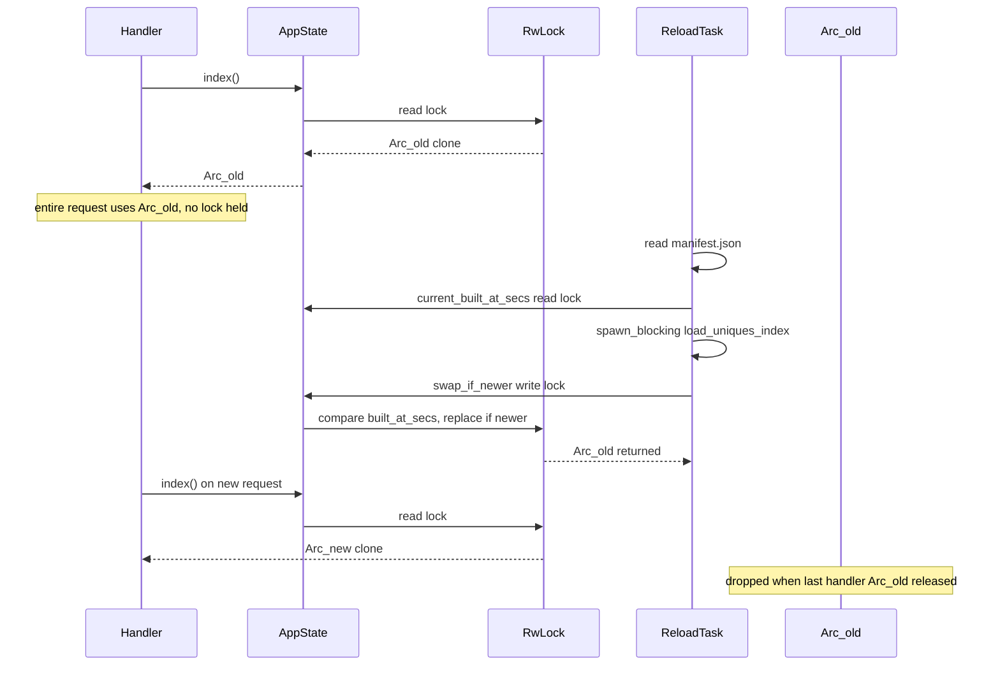

# Hot-reload UniquesIndex

## Current state

Today the server loads once at startup and never refreshes:

- [`main.rs`](../src/main.rs): `Arc::new(load_index(...))` → Axum `.with_state`
- [`http/state.rs`](../src/http/state.rs): `AppState { index: UniquesIndex }` — owned directly, no swap point
- Handlers call `state.index()` → `&UniquesIndex` (borrow from shared `Arc<AppState>`)
- No background tasks exist in the crate

Current `AppState` structure is a single pointer to UniquesIndex:

```rust
pub struct AppState {
    pub(crate) index: UniquesIndex,
}
```

## Concurrency considerations with Tokio

### Tokio “cron”-style jobs

Tokio has no cron scheduler built in. The idiomatic pattern is:

```rust
let mut interval = tokio::time::interval(Duration::from_secs(60));
interval.set_missed_tick_behavior(tokio::time::MissedTickBehavior::Skip);

loop {
    interval.tick().await;
    // do work
}
```

- Spawn it with `tokio::spawn(...)` alongside `axum::serve` in `main`.
- **First tick fires immediately** by default; skip it with an initial `interval.tick().await` if you want the first check after 60s.
- `MissedTickBehavior::Skip` prevents a burst of catch-up ticks if a reload takes longer than 60s.
- **Blocking work** (`load_uniques_index` reads ~250MB from disk and builds bitmaps/indexes) must run in `tokio::task::spawn_blocking` so the async runtime stays responsive.

### Thread safety for the swap

**Do not mutate `UniquesIndex` in place.** Build a new struct, wrap in `Arc::new(...)`, then publish it only if strictly newer.

**Use `std::sync::RwLock<Arc<UniquesIndex>>`** — no new dependency. The reload task needs to inspect `built_at_secs` under a lock before committing a swap; `RwLock` makes that straightforward.

> **Note on `ArcSwap`:** it can also do conditional swaps via `rcu(|current| ...)` or `compare_and_swap`, without a traditional lock. We're using `RwLock` here because the inspect-then-swap flow is explicit and the write lock is held only for the comparison + pointer replace (microseconds), never during the expensive disk load.

| Approach | Reads (per request) | Swap (reload task) | Conditional swap? |
| -------- | ------------------- | ------------------ | ----------------- |
| `RwLock<Arc<UniquesIndex>>` (chosen) | brief read lock → clone `Arc` | write lock → compare `built_at_secs` → replace or skip | yes, under write lock |
| `ArcSwap<UniquesIndex>` | lock-free `load_full()` | `rcu` / `compare_and_swap` | yes, via RCU closure |
| `Mutex<UniquesIndex>` | lock on every read for entire request | lock to replace | yes, but serializes queries |

**Handlers do not hold the lock for the request lifetime.** A custom Axum extractor clones the `Arc` once per request (see §5 below); handlers never touch `AppState` directly for index access.

In-flight requests keep their cloned `Arc`; new requests get the new `Arc` after swap. When the last `Arc` to the old index drops, `UniquesIndex::drop` runs and logs deallocation.

**You do not need to change the outer `Arc<AppState>`** passed to Axum. The reload background task holds the same `Arc<AppState>` and calls `state.swap_if_newer(...)`.

### Two-phase reload with write-lock guard

The expensive load runs **outside** any lock. The write lock is taken only at the end to validate and commit:

1. **Cheap pre-check** (read lock): read `current_built_at_secs`, compare to disk manifest — skip if `disk <= current`
2. **Load** (`spawn_blocking`): build full `UniquesIndex` off-thread, no lock held
3. **Commit** (write lock): re-check `new.built_at_secs > current.built_at_secs` (guards TOCTOU race conditions if another swap landed while loading), swap `Arc` if still newer, release, log old→new.



---

## Proposed module layout

New submodule under `index/`:

```
index/
  reload/
    mod.rs       re-exports, spawn_hot_reload()
    source.rs    IndexSource trait (future multi-source hook)
    disk.rs      DiskIndexSource — manifest read + full load from INDEX_PATH
```

Register in [`index.rs`](../src/index.rs):

```rust
pub mod reload;
pub use reload::spawn_hot_reload;
```

### `IndexSource` trait (extensibility)

```rust
pub trait IndexSource: Send + Sync {
    fn read_built_at_secs(&self) -> Result<u64>;
    fn load_index(&self) -> Result<UniquesIndex>;
}
```

First impl: `DiskIndexSource { index_dir: PathBuf }` using `INDEX_PATH`.

Future sources (S3, HTTP, inotify) implement the same trait; the reload loop stays unchanged.

### Reload loop (`reload/mod.rs`)

Pseudocode:

```rust
pub fn spawn_hot_reload(state: Arc<AppState>, source: impl IndexSource + 'static) {
    tokio::spawn(async move {
        let mut interval = tokio::time::interval(Duration::from_secs(60));
        interval.set_missed_tick_behavior(MissedTickBehavior::Skip);
        interval.tick().await; // optional: defer first check

        loop {
            interval.tick().await;
            if let Err(e) = reload_tick(&state, &source).await {
                eprintln!("index hot-reload tick failed: {e:#}");
            }
        }
    });
}

async fn reload_tick(state: &AppState, source: &impl IndexSource) -> Result<()> {
    let disk_built_at = source.read_built_at_secs()?;
    let current = state.current_built_at_secs(); // read lock
    if disk_built_at <= current {
        return Ok(());
    }

    eprintln!(
        "index hot-reload starting: built_at_secs {current} -> {disk_built_at} (loading from disk...)"
    );
    let started = std::time::Instant::now();

    let new_index = tokio::task::spawn_blocking({
        let source = /* clone source */;
        move || source.load_index()
    })
    .await??;

    let elapsed = started.elapsed();

    // write lock: inspect current, swap only if new is strictly newer
    match state.swap_if_newer(Arc::new(new_index)) {
        Some((old_secs, new_secs)) => {
            eprintln!(
                "index hot-reloaded: built_at_secs {old_secs} -> {new_secs} (loaded in {:.2}s)",
                elapsed.as_secs_f64()
            );
        }
        None => {
            eprintln!(
                "index hot-reload skipped after load: built_at_secs still {current} (loaded in {:.2}s, another swap won)",
                elapsed.as_secs_f64()
            );
        }
    }
    Ok(())
}
```

**Logging summary** (all via `eprintln!`, matching existing loader style):

| Event | When |
| ----- | ---- |
| `index hot-reload starting: built_at_secs X -> Y (loading from disk...)` | manifest pre-check passes, before `spawn_blocking` |
| `index hot-reloaded: built_at_secs X -> Y (loaded in N.NNs)` | load succeeded and `swap_if_newer` committed |
| `index hot-reload skipped after load: ... (loaded in N.NNs, another swap won)` | load succeeded but write-lock re-check found a newer index already installed (TOCTOU) |
| `index hot-reload tick failed: ...` | manifest read, load, or join error — existing outer catch |

On load failure: log error, **keep serving the old index** (no partial swap). No duration line on failure (or log `failed after N.NNs` if the timer was started — optional).

---

## Changes to existing files

### 1. [`index/loader.rs`](../src/index/loader.rs) — split loading

Extract from `load_index`:

- `read_manifest(index_dir: &Path) -> Result<IndexManifest>` — reads only `manifest.json` (cheap poll step)
- `load_uniques_index(index_dir: &Path) -> Result<UniquesIndex>` — current body of `load_index` without wrapping `AppState`
- `load_index` becomes `Ok(AppState::new(load_uniques_index(index_dir)?))`

### 2. [`http/state.rs`](../src/http/state.rs) — swap container

```rust
use std::sync::{Arc, RwLock};

pub struct AppState {
    index: RwLock<Arc<UniquesIndex>>,
}

impl AppState {
    pub fn index(&self) -> Arc<UniquesIndex> {
        self.index.read().expect("index lock poisoned").clone()
    }

    pub fn current_built_at_secs(&self) -> u64 {
        self.index.read().expect("index lock poisoned").manifest.built_at_secs
    }

    /// Swap only if `new` has a strictly higher `built_at_secs`.
    /// Returns `Some((old_secs, new_secs))` when swapped, `None` if skipped.
    pub(crate) fn swap_if_newer(&self, new: Arc<UniquesIndex>) -> Option<(u64, u64)> {
        let mut guard = self.index.write().expect("index lock poisoned");
        let old_secs = guard.manifest.built_at_secs;
        let new_secs = new.manifest.built_at_secs;
        if new_secs > old_secs {
            *guard = new;
            Some((old_secs, new_secs))
        } else {
            None
        }
    }
}
```

`index()` return type changes from `&UniquesIndex` to `Arc<UniquesIndex>`. Non-handler call sites (tests, reload module) that pass `state.index()` to `fn(..., index: &UniquesIndex)` continue to compile via `Deref` coercion. HTTP handlers use the `IndexSnapshot` extractor instead of calling `state.index()` manually.

### 3. [`index/uniques_index.rs`](../src/index/uniques_index.rs) — deallocation log

```rust
impl Drop for UniquesIndex {
    fn drop(&mut self) {
        eprintln!(
            "UniquesIndex deallocated (built_at_secs={}, dir={})",
            self.manifest.built_at_secs,
            self.index_dir.display(),
        );
    }
}
```

### 4. [`main.rs`](../src/main.rs) — wire background task

After `let state = Arc::new(load_index(...)?)`:

```rust
let source = DiskIndexSource::new(PathBuf::from(&index_path));
spawn_hot_reload(Arc::clone(&state), source);
```

Optional env `INDEX_RELOAD_INTERVAL_SECS` (default `60`) for local tuning — not required for v1.

### 5. [`http/extract.rs`](../src/http/extract.rs) — `IndexSnapshot` extractor

Axum supports this via a custom `FromRequestParts` extractor. It runs once per request before the handler body, clones `state.index()` (brief read lock), and hands the handler a stable `Arc<UniquesIndex>` for the whole request. Handlers no longer need `State<Arc<AppState>>` when they only need the index.

```rust
use std::ops::Deref;
use std::sync::Arc;
use axum::extract::FromRequestParts;
use axum::http::request::Parts;

use crate::http::state::AppState;
use crate::index::UniquesIndex;

/// Per-request snapshot of the current index (one Arc clone, held for the handler lifetime).
pub struct IndexSnapshot(pub Arc<UniquesIndex>);

impl Deref for IndexSnapshot {
    type Target = UniquesIndex;
    fn deref(&self) -> &Self::Target {
        &self.0
    }
}

impl FromRequestParts<Arc<AppState>> for IndexSnapshot {
    type Rejection = std::convert::Infallible;

    async fn from_request_parts(
        _parts: &mut Parts,
        state: &Arc<AppState>,
    ) -> Result<Self, Self::Rejection> {
        Ok(IndexSnapshot(state.index()))
    }
}
```

Register in [`http.rs`](../src/http.rs): `pub mod extract; pub use extract::IndexSnapshot;`

**Handler migration** (4 handlers today — cards + effects):

```rust
// before
pub async fn get_cards_v2(
    State(state): State<Arc<AppState>>,
    RawQuery(query): RawQuery,
) -> ... {
    let index = state.index();
    ...
}

// after
pub async fn get_cards_v2(
    IndexSnapshot(index): IndexSnapshot,
    RawQuery(query): RawQuery,
) -> ... {
    // `index` is Arc<UniquesIndex>; Deref gives &UniquesIndex for query fns
    ...
}
```

Routes that don't need the index (`GET /healthz`) stay unchanged — no extractor, no `AppState` in signature.

If `AppState` later gains HTTP-only fields, handlers that need both can take `State<Arc<AppState>>` **and** `IndexSnapshot` in the same signature; Axum runs both extractors.

### 6. Tests

- Unit test in `index/reload/` (or `loader`): manifest comparison logic (`disk > current` triggers load, `disk <= current` skips)
- Existing integration tests should pass with minimal changes because `AppState::new` and `state.index()` API remain compatible via `Arc` + `Deref`
- Unit test `swap_if_newer`: swaps when newer, skips when equal/older
- Optional: test that `swap_if_newer` updates `current_built_at_secs`

---

## Dependency

No new crates — `std::sync::RwLock` only.

---

## Operational notes

- **Memory during reload**: briefly two full indexes exist (old + new being built). Old frees once in-flight `Arc` clones drop.
- **Reload duration**: a full `ALL_SETS` load may take tens of seconds; `Skip` missed ticks avoids overlapping reload storms. The reloader logs when a load **starts** (with old→disk `built_at_secs`) and when it **finishes** (swap committed or skipped, with elapsed seconds).
- **Manifest-only poll** is cheap; full load only when `built_at_secs` strictly increases (guards against accidental downgrade or same-version rewrite).

---

## Implementation notes

Built as specified above. Deviations encountered during implementation:

| Area | Plan | Built |
| ---- | ---- | ----- |
| `IndexSource` trait | `Send + Sync` | `Send + Sync + Clone` — required to move a clone into `spawn_blocking` |
| `reload_tick` signature | `source: &impl IndexSource` | `source: &(impl IndexSource + Clone + 'static)` — satisfies `spawn_blocking` lifetime bounds |
| `INDEX_RELOAD_INTERVAL_SECS` | optional for v1 | implemented in `spawn_hot_reload` (default 60) |
| `index.rs` re-exports | `spawn_hot_reload` only | also re-exports `DiskIndexSource`; `lib.rs` re-exports both for `main.rs` |
| Handler query calls | Deref coercion sufficient | handlers pass `&index` explicitly when calling `fn(..., state: &UniquesIndex)` — `Arc<UniquesIndex>` binding does not auto-coerce by value |
| Test call sites | minimal changes via Deref | `state.index().as_ref()` for `&UniquesIndex` function args; two tests bind `let index = state.index()` before holding refs from accessor return values |
| Reload tick unit test | manifest comparison in `index/reload/` | not added — `swap_if_newer` covered in `http/state.rs` `#[cfg(test)]`; all 58 integration/unit tests pass |
