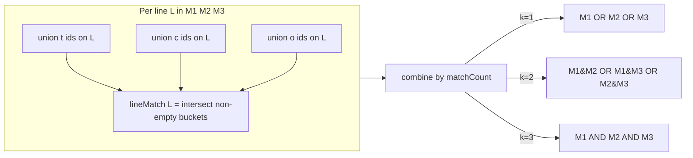

# Plan 14: Effect `matchCount` filtering (`/api/v2/cards`)

## Goal

Add per-slot `effect[N][matchCount]` to `GET /api/v2/cards`. When `matchCount` is `2` or `3`, require
that many **main-effect lines** (M1/M2/M3) each satisfy the slot's t/c/o predicates on the same line,
instead of the current default where matching **any one** line is enough.

Documented in [`docs/api-spec.md`](../../docs/api-spec.md). No `alt-indexer` changes.

## Semantics

Each `effect[N]` group already builds a **per-line match** on M1/M2/M3: for line `L`, intersect the
non-empty `t`/`c`/`o` bucket unions on that line (same-line co-occurrence).

| `matchCount` | Behavior |
|---|---|
| `1` (default) | `lineMatch(M1) OR lineMatch(M2) OR lineMatch(M3)` — unchanged |
| `2` | card must match on **≥2** lines |
| `3` | card must match on **all 3** lines |

Example: `effect[0][t]=24&effect[0][c]=191&effect[0][matchCount]=2` returns cards where at least two
of M1/M2/M3 each contain both trigger 24 and condition 191 on the same line.



- Applies **per effect slot** (`effect[0][matchCount]`, `effect[1][matchCount]`, …).
- Does **not** apply to `support[...]` (only one echo line exists).
- Default is `1` when omitted.
- Invalid values (`0`, `4`, non-numeric) → `400`.
- A lone `matchCount` without any t/c/o predicates does not create a filter slot.

## Code changes

### 1. Model + parse

[`src/http/api/cards/models.rs`](../src/http/api/cards/models.rs):

- Add `match_count: u8` to `EffectSlotFilter` (default `1`).

[`src/http/api/cards/parse.rs`](../src/http/api/cards/parse.rs):

- Extend `parse_effect_param_key` to accept `effect[N][matchCount]` in addition to `[t]`, `[c]`, `[o]`.
- Parse value as `1`, `2`, or `3`; reject anything else with `400`.
- `is_empty()` stays t/c/o-only.

### 2. Query bitmap

[`src/index/query/cards.rs`](../src/index/query/cards.rs):

Replace `effect0_bitmap_main_lines` with `effect_slot_bitmap(..., match_count)` and
`combine_line_matches`:

- Compute `line_match(L)` for M1/M2/M3 via existing `bitmap_intersect_buckets_on_line`.
- Lines with no matching predicates → `None` (excluded from k-of-n count).
- Combine:
  - `match_count = 1`: OR across present line matches.
  - `match_count = 2`: OR of pairwise intersections `(M1∩M2) | (M1∩M3) | (M2∩M3)`.
  - `match_count = 3`: `M1 ∩ M2 ∩ M3` (all three must be present).
- Pass `slot.match_count` from `build_bitmap`.

### 3. Tests

[`src/http/api/cards/parse.rs`](../src/http/api/cards/parse.rs) (module tests):

- Default `matchCount` is `1`.
- Valid `2` and `3`.
- Reject `0`, `4`, non-numeric.

[`src/index/query/cards.rs`](../src/index/query/cards.rs) (module tests) + [`test_support.rs`](../src/http/api/cards/test_support.rs):

- Extend fixture with dedicated idGds (`25` trigger, `192` condition) so existing tests are
  unaffected:
  - Card 7: `25`+`192` on M1 **and** M2.
  - Card 8: `25`+`192` on M1 only.
- `t=25&c=192` → cards `{7, 8}` (`matchCount=1`).
- Same query with `matchCount=2` → `{7}` only.
- `matchCount=3` → empty (no card matches on all three lines).

### 4. Docs

[`docs/api-spec.md`](../../docs/api-spec.md) already documents `effect[0][matchCount]`. Optional
clarifying sentence under effect filters:

> `matchCount` counts how many of M1/M2/M3 must each satisfy the slot's t/c/o predicates on the same line.

## Out of scope

- **demo-ui** ([`demo-ui/src/api/buildQuery.ts`](../../demo-ui/src/api/buildQuery.ts)): no UI control
  for `matchCount` yet.
- **`support[matchCount]`**: not in spec; echo has a single line so `>1` would always fail.

## Verification

```powershell
cd uniques-http-api
cargo test
```

Manually (with index loaded): compare `effect[0][t]=24&effect[0][c]=191` vs the same query with
`&effect[0][matchCount]=2` — the second result should be a subset.

## Follow-up: `/api/v2/effects/filtered`

**Deferred** — not part of this plan.

The autocomplete endpoint ([`src/http/api/effects/handlers.rs`](../src/http/api/effects/handlers.rs))
uses a fast per-line partial algorithm (“any one line matches”). Honoring `matchCount` correctly
would require simulating the full slot bitmap for each catalog candidate, which could significantly
increase latency on `/api/v2/effects/filtered`.

When revisited:

1. Reuse the same `effect_slot_bitmap(..., match_count)` logic as `/api/v2/cards`.
2. For each candidate id of the edited part, append it to the slot's t/c/o buckets, compute the slot
   bitmap with the slot's `matchCount`, intersect with `Base`, and keep the candidate only if
   non-empty.
3. Consider optimizations if needed (e.g. slow path only when `matchCount > 1`, cache line-match
   bitmaps, pre-filter candidates by line presence).

Until then, `/api/v2/effects/filtered` **ignores** `matchCount` and continues using `matchCount=1`
semantics for the edited group. Clients using `matchCount=2|3` may see autocomplete suggestions that
do not all yield cards when selected — acceptable as a temporary trade-off.
