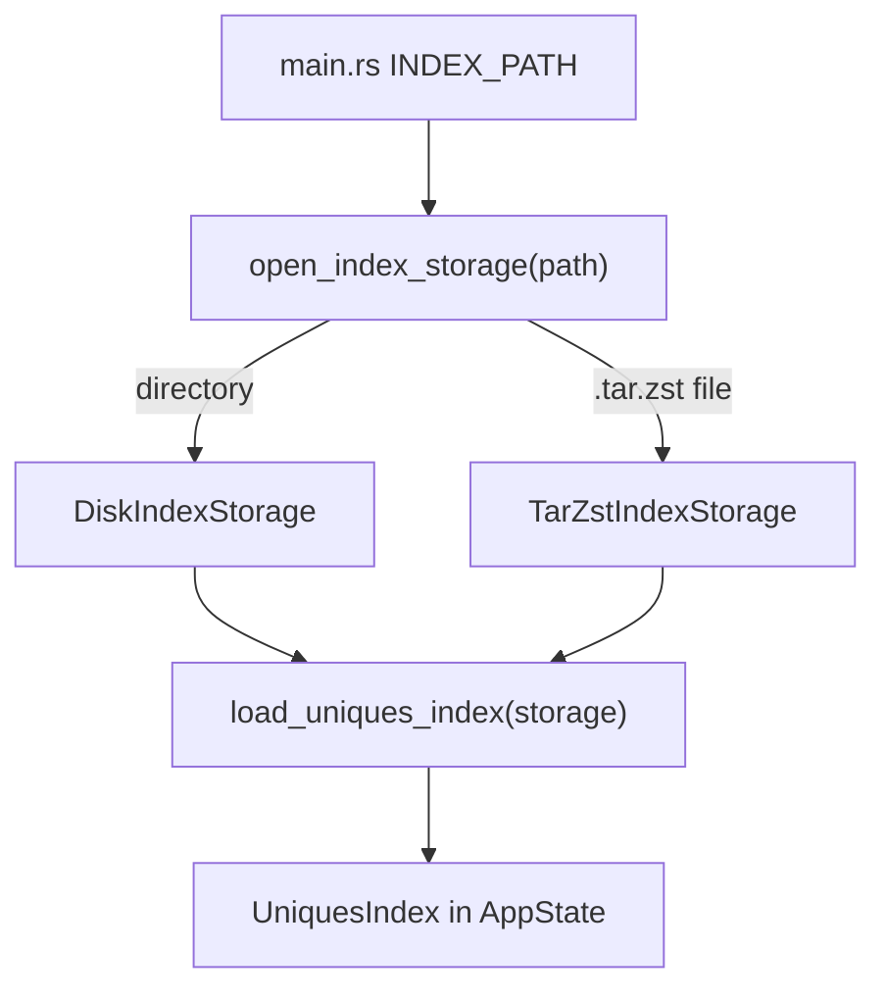

# Load index from directory or `.tar.zst`

## Context

[`loader.rs`](../src/index/loader.rs) is the single place that reads index files. Today every read goes through a storage abstraction (`IndexStorage`) rather than calling `std::fs` directly from orchestration code.

You already have:

- [`IndexSource`](../src/index/reload/source.rs) + [`DiskIndexSource`](../src/index/reload/disk.rs) for hot-reload (disk-only, stays that way)
- [`just compress-index`](../../justfile) producing `build/full_index.tar.zst` (entries like `catalog.json`, `id_gd/1.roar` — no `./` prefix; see **Archive path convention** below)

## Archive path convention

**Create (justfile):** update [`compress-index`](../../justfile) to strip `./` at pack time using GNU tar `--transform`:

```bash
tar -C build/full_index/ALL_SETS -I "zstd -19" --transform 's,^\./,,' -cvf build/full_index.tar.zst .
```

Archives produced by this recipe store clean paths (`catalog.json`, `id_gd/1.roar`) matching the relative paths in summary JSON.

**Read (Rust):** `TarZstIndexStorage` still normalizes tar entry paths defensively — strip a leading `./`, normalize to forward slashes, skip directory-only entries — so older archives or tarballs built without `--transform` keep working.

Summary JSON already uses the same portable relative paths (`factions/AX.roar`, `stats/cost/01.roar`); idGd catalog entries use bare filenames joined with `id_gd/` in the loader.

---



## Phase 1 — Abstract disk reads (no behavior change)

### New module layout

Use the Rust **parent-file** pattern (no `mod.rs`): [`loader.rs`](../src/index/loader.rs) stays the module root; submodules live in a sibling `loader/` directory with explicit filenames.

```
index/
  loader.rs              # pub mod storage; pub mod disk; orchestration + re-exports
  loader/
    storage.rs           # IndexStorage trait + shared helpers
    disk.rs              # DiskIndexStorage
    archive.rs           # TarZstIndexStorage (phase 2)
```

| File | Role |
|------|------|
| [`loader.rs`](../src/index/loader.rs) | Public types, `build_*` helpers, orchestration (`load_uniques_index`, `read_manifest`, `load_index`) |
| [`loader/storage.rs`](../src/index/loader/storage.rs) | `IndexStorage` trait + shared helpers |
| [`loader/disk.rs`](../src/index/loader/disk.rs) | `DiskIndexStorage` |

[`index.rs`](../src/index.rs) keeps `pub mod loader;` — unchanged export surface.

### `IndexStorage` trait

Path-relative reads only (matches how summaries reference files):

```rust
pub trait IndexStorage {
    /// Canonical directory or archive path for logs and `UniquesIndex.index_dir`.
    fn source_path(&self) -> &Path;

    fn read_bytes(&self, relative_path: &str) -> Result<Vec<u8>>;
    fn has_file(&self, relative_path: &str) -> bool;
}
```

Shared helpers in `storage.rs` (not duplicated in each impl):

- `read_text` → UTF-8 string
- `read_json<T: Deserialize>` → parse JSON
- `read_roar` → `RoaringBitmap::deserialize_from`

Use **forward-slash** relative paths everywhere (`"catalog.json"`, `"id_gd/1.roar"`, `"factions/AX.roar"`) — same strings already stored in summary JSON.

### `DiskIndexStorage`

- Construct from `&Path`, **canonicalize** once (preserves current behavior)
- `read_bytes`: `root.join(relative_path)` + `fs::read`
- `has_file`: `root.join(relative_path).is_file()`

### Refactor orchestration in `loader.rs`

Replace path-based private helpers with storage-based ones:

| Current | After |
|---------|-------|
| `load_uniques_index(index_dir: &Path)` | `load_uniques_index_from(storage: &impl IndexStorage)` + thin `load_uniques_index(path)` wrapper |
| `read_manifest(index_dir)` | `read_manifest_from(storage)` + disk wrapper |
| `load_json(path)` | `read_json(storage, "manifest.json")` etc. |
| `Catalog::load(path)` | `read_json::<Catalog>(storage, "catalog.json")` |
| `BitmapStore::load(id, path)` | `read_roar(storage, "id_gd/{file}")` with same idGd context in error messages |
| `index_dir.join(...)` + `is_file()` | `storage.has_file(...)` + `read_roar` |

`UniquesIndex.index_dir` stays a `PathBuf` for now: set to the canonical directory path for disk loads; for archives (phase 2) store the archive file path (logging only — no runtime dependency on extracted files).

**No changes** to [`DiskIndexSource`](../src/index/reload/disk.rs) behavior: it continues to call disk wrappers; hot-reload remains directory-only.

### Phase 1 verification

- `cargo test -p uniques-http-api` — existing fixture tests in [`tests/load_index.rs`](../tests/load_index.rs) and integration tests must pass unchanged
- Optional: unit test `DiskIndexStorage` against `tests/fixtures/minimal_index`

---

## Phase 2 — Read from on-disk `.tar.zst`

### Dependencies

Add to [`Cargo.toml`](../Cargo.toml):

- `tar`
- `zstd`

### `TarZstIndexStorage` (`loader/archive.rs`)

Open flow:

1. `fs::File::open(archive_path)`
2. `zstd::Decoder::new(file)`
3. `tar::Archive::new(decoder).entries()`
4. Build `HashMap<String, Vec<u8>>` in one pass

**Path normalization (defensive read-side):** when indexing tar entries, normalize keys before inserting into the map:

```rust
fn normalize_entry_path(path: &Path) -> Option<String> {
    // strip leading "./", normalize to forward slashes, skip directory-only entries
}
```

Directory entries are skipped via the tar header (`entry_type().is_dir()`), not by trailing `/` on the path string.

Lookup keys from the loader (`"catalog.json"`, `"id_gd/1.roar"`, …) match directly. Defensive stripping covers legacy archives that still contain `./` prefixes.

Implement `IndexStorage` via map lookup. Missing entry → `anyhow` error with archive path + relative key.

Memory: one in-memory copy of every file in the archive. This matches today's eager load model (~same total bytes as reading the directory; map keys add minor overhead).

### Auto-detect entry point

Add in [`loader.rs`](../src/index/loader.rs):

```rust
pub fn open_index_storage(path: &Path) -> Result<AnyIndexStorage> {
    if path.is_dir() {
        Ok(AnyIndexStorage::Disk(DiskIndexStorage::new(path)?))
    } else if is_tar_zst(path) {
        Ok(AnyIndexStorage::Archive(TarZstIndexStorage::open(path)?))
    } else {
        bail!("INDEX_PATH must be a directory or a .tar.zst file")
    }
}
```

Use an enum wrapper for a single concrete return type:

```rust
pub enum AnyIndexStorage { Disk(DiskIndexStorage), Archive(TarZstIndexStorage) }
```

`is_tar_zst` checks extension `zst` and file stem ending in `.tar` (e.g. `full_index.tar.zst`).

Wire [`load_index`](../src/index/loader.rs) and [`main.rs`](../src/main.rs) through `open_index_storage` instead of assuming a directory. Update the `INDEX_PATH` error message to mention `.tar.zst`.

**Out of scope (per choices):** `ArchiveIndexSource`, GCP/object storage, Docker image changes, Windows `compress-index` recipe.

### Tests for archive loading

Add [`tests/load_index_archive.rs`](../tests/load_index_archive.rs):

1. At test runtime, pack `tests/fixtures/minimal_index` into a temp `.tar.zst` using the `tar` + `zstd` crates with **clean entry paths** (no `./` prefix — same as updated `compress-index`)
2. Assert a second load from an archive **with** `./` prefixes still works (defensive normalization)
3. Call `load_index` on the clean archive
4. Assert same properties as [`load_index.rs`](../tests/load_index.rs)

Do **not** commit a binary fixture or depend on `build/full_index.tar.zst` (gitignored / machine-local).

### Manual smoke test

```powershell
just compress-index   # unix; or existing build/full_index.tar.zst
$env:INDEX_PATH = ".\build\full_index.tar.zst"
cargo run -p uniques-http-api --release
```

---

## Files touched (summary)

**Phase 1**

- Refactor: [`loader.rs`](../src/index/loader.rs) — slim down to orchestration + `pub mod` declarations
- New: [`loader/storage.rs`](../src/index/loader/storage.rs), [`loader/disk.rs`](../src/index/loader/disk.rs)
- Minor: [`reload/disk.rs`](../src/index/reload/disk.rs) (import path updates only)

**Phase 2**

- New: [`loader/archive.rs`](../src/index/loader/archive.rs)
- Edit: [`justfile`](../../justfile) (`compress-index` `--transform`), [`Cargo.toml`](../Cargo.toml), [`main.rs`](../src/main.rs), [`loader.rs`](../src/index/loader.rs)
- New: [`tests/load_index_archive.rs`](../tests/load_index_archive.rs)

## Future hooks (not in this PR)

- `IndexStorage` is the extension point for GCP: a reader that fetches bytes by object key without changing load orchestration
- Hot-reload from archive: new `IndexSource` impl; cheap manifest poll would need either a sidecar manifest or partial tar scan — defer until needed
- Docker: `COPY build/full_index.tar.zst` + `INDEX_PATH=/opt/index/full_index.tar.zst` instead of copying the full tree

## Status

- [x] Phase 1 — `IndexStorage` + `DiskIndexStorage`, loader refactor
- [x] Phase 2 — `TarZstIndexStorage`, `open_index_storage`, archive tests
- [x] `just compress-index` `--transform` for clean tar entry paths
