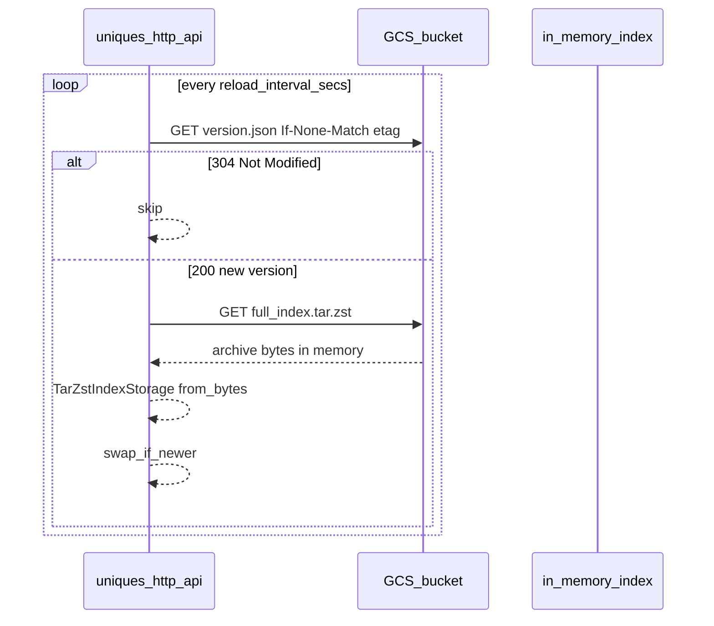

# GCS index load + hot-reload with config-rs

## Context

The HTTP API already has the right extension points:

- [`IndexStorage`](../src/index/loader/storage.rs) — byte reads for load orchestration (disk + in-memory tar.zst today)
- [`IndexSource`](../src/index/reload/source.rs) — cheap version poll + full `load_index()` for hot-reload
- [`reload_tick`](../src/index/reload/tick.rs) — compares monotonic `u64` version, loads in `spawn_blocking`, atomically swaps via `AppState::swap_if_newer`

Hot-reload is implemented but **disabled** in [`main.rs`](../src/main.rs). Config is three env vars via [`env.rs`](../src/env.rs) + dotenvy.

**Index scale (current ALL_SETS):** ~2,647 files, ~269 MB uncompressed, ~73 MB as `full_index.tar.zst`.

**Your update pattern:** full ALL_SETS re-merge/republish each time. That matters: [`index-core` merge](../../index-core/src/merge.rs) remaps card indices and **rewrites essentially all bitmap files**, so per-file incremental sync saves little complexity for little gain.

---

## Transfer-minimization options

| Option | Poll (every N sec) | On update | Best when |
|--------|-------------------|-----------|-----------|
| **A. Sidecar `version.json` + single blob** (recommended) | 1 small GET (~150 B) | 1 GET of `full_index.tar.zst` (~73 MB) | Full republish; simplest ops |
| **B. Object metadata poll (no sidecar)** | 1 metadata GET on archive object (~0 B body) | Same full blob GET | Want one GCS object only; set `x-goog-meta-version` at upload |
| **C. Per-file object tree** | 1 GET `manifest.json` + N file GETs | ~2,647 GETs, ~269 MB total | **Poor fit** for full merge |
| **D. Immutable versioned paths** | 1 GET `latest.json` pointer | 1 GET of versioned blob URL | CDN/immutable caching; slightly more publish complexity |
| **E. Conditional requests (304)** | GET/HEAD with `If-None-Match` / generation | Full GET only when version changed | Complements A/B/D; avoids accidental re-download |

### Recommendation: **Option A + E**



**Why not per-file (C)?** Full merge rewrites ~all files. You would pay **2,647 requests** instead of **1**, with similar total bytes and much more code (inventory, ETag map, partial cache coherency).

**Why a sidecar `version.json`?** Reading the version from inside a tar.zst requires either downloading the whole archive or maintaining a separate manifest object anyway. A tiny sidecar keeps polls to ~150 bytes regardless of archive size.

**Versioning model (semantic abstraction):**

| Layer | Field | Notes |
|-------|-------|-------|
| Index `manifest.json` | `built_at_secs: u64` | **Unchanged** — build/merge pipeline keeps writing Unix seconds |
| Sidecar `version.json` | `version: u64` | Protocol-facing publish contract for object-store reload |
| Publish mapping | `version = manifest.built_at_secs` | Same integer, different name in the sidecar only |
| Reload comparison | monotonic `u64` | Remote reads `version.json`; disk reads `manifest.built_at_secs` (same value today) |

**Publish contract (CI / justfile):**

```json
{
  "version": 1780028112,
  "archive_object": "index/full_index.tar.zst",
  "sha256": "…optional integrity check…"
}
```

Rust sidecar type:

```rust
#[derive(Debug, Deserialize)]
struct IndexVersionSidecar {
    version: u64,
    archive_object: String,
    #[serde(default)]
    sha256: Option<String>,
}
```

Upload order: archive first, then `version.json` last (pointer flip = atomic publish).

---

## config-rs layout

Replace ad-hoc `std::env::var` reads with a typed `Settings` struct. Keep dotenvy for local secrets; config-rs layers on top.

**Files to add under [`config/`](../config/):**

| File | Purpose |
|------|---------|
| `default.toml` | Safe defaults (disk source, reload off, port 8080) |
| `local.toml` | Dev: disk/archive paths, reload on, shorter interval |
| `production.toml` | GCS source, reload on, Cloud Run port |

**Load order (config-rs builder):**

1. `config/default.toml`
2. `config/{APP_ENV}.toml` (env var `APP_ENV`, default `"local"`)
3. Environment variables (`CONFIG__`-style or mapped names — pick one prefix and document it)
4. Existing dotenvy (`.env` + `.env.local`) loaded **before** config build so env overrides still work

**Example shape:**

```toml
# config/default.toml
[server]
port = 8080

[index]
source = "disk"           # disk | archive | object_store
path = "./build/full_index/ALL_SETS"   # disk/archive only

[index.reload]
enabled = false
interval_secs = 60

[index.object_store]
url = "gs://your-bucket/index"   # gs:// today; s3://, az://, memory:// for tests
# ADC for GCS — credentials sourced automatically by object_store (Cloud Run SA or gcloud ADC locally)
```

```toml
# config/production.toml
[index]
source = "object_store"

[index.reload]
enabled = true
interval_secs = 60

[index.object_store]
url = "gs://your-prod-bucket/index"
```

**Migration from current env vars:**

| Today | config-rs field |
|-------|-----------------|
| `INDEX_PATH` | `index.path` (disk/archive only) |
| `PORT` | `server.port` |
| `INDEX_RELOAD_INTERVAL_SECS` | `index.reload.interval_secs` |
| (new) | `index.reload.enabled`, `index.source`, `index.object_store.*`, `APP_ENV` |

Backward compatibility: if `INDEX_PATH` is set, treat as override for `index.path` during transition (log deprecation once).

---

## Rust module design

### 1. `config` module (new)

- [`src/config.rs`](../src/config.rs) — `Settings`, `IndexSourceKind`, `ObjectStoreSettings`, `load_settings()`
- Add `config` and `object_store` crates to [`Cargo.toml`](../Cargo.toml)

### 2. Object store client (new)

[`src/index/loader/object_store.rs`](../src/index/loader/object_store.rs):

Use the **[`object_store`](https://docs.rs/object_store)** crate (Apache Arrow ecosystem) as the sole remote-storage dependency. Enable the `gcp` feature for production; other backends (`aws`, `azure`, `http`) stay available behind the same `ObjectStore` trait for future environments.

**No disk cache.** The end state is already fully in memory: [`TarZstIndexStorage`](../src/index/loader/archive.rs) reads a tar.zst stream and builds a `HashMap<String, Vec<u8>>` (~269 MB for ALL_SETS). A filesystem cache would only duplicate that work and is a poor fit for Cloud Run (container filesystem is read-only except `/tmp`, which is a size-capped ephemeral tmpfs that does not survive cold starts).

**Load path:**

```text
object_store.get(archive) → Vec<u8> (~73 MB compressed)
  → TarZstIndexStorage::from_bytes(&bytes)
  → load_uniques_index_from(&storage)
```

**Small refactor to [`archive.rs`](../src/index/loader/archive.rs):**

- Extract shared logic into `open_from_reader(reader: impl Read, source_label: &str) -> Result<Self>`
- Keep `open(path)` as `File::open` + `open_from_reader`
- Add `from_bytes(bytes: &[u8])` using `std::io::Cursor` — used by the object-store path
- `source_path()` can return a synthetic label (e.g. `gs://bucket/index/full_index.tar.zst`) for logs only

**Dependency (Cargo.toml):**

```toml
object_store = { version = "0.11", features = ["gcp"] }
# add "aws" / "azure" features later if needed — no API rewrite required
```

**Client shape:**

```rust
pub struct ObjectStoreIndexClient {
    store: Arc<dyn ObjectStore>,
    prefix: object_store::path::Path,   // e.g. "index"
    cached_etag: Mutex<Option<String>>, // in-process only; for conditional version polls
}
```

**Store construction from config URL:**

- `gs://bucket/prefix` → `GoogleCloudStorageBuilder::from_env().with_bucket_name(...).build()` (ADC: Cloud Run metadata or `gcloud auth application-default login`)
- Future: `s3://…`, `az://…` via the same URL parser / builder pattern — config change only, no loader rewrite

**Methods:**

- `fetch_version() -> IndexVersionSidecar` — `store.get(&prefix.child("version.json"))`, parse `version: u64` + optional `sha256`; capture `ObjectMeta::e_tag` from response
- `fetch_archive_bytes(sidecar) -> Vec<u8>` — `store.get` archive object, collect payload bytes in memory; optional sha256 verify against sidecar
- Poll optimization: pass prior etag via `GetOptions { if_none_match: … }` when object_store / backend supports conditional GET (304 → skip body, no archive download)

**Do not implement `IndexStorage` over live object-store reads** — 2,647 remote reads per load would be slow and expensive. Always **download archive bytes once → `TarZstIndexStorage::from_bytes`**.

### 3. Remote reload source (new)

[`src/index/reload/remote.rs`](../src/index/reload/remote.rs):

```rust
impl IndexSource for RemoteIndexSource {
    fn read_version(&self) -> Result<u64>  // sidecar version.json only
    fn load_index(&self) -> Result<UniquesIndex>   // fetch archive bytes → TarZstIndexStorage::from_bytes → load_uniques_index_from
}
```

Wraps `ObjectStoreIndexClient` (protocol-agnostic). Mirror [`DiskIndexSource`](../src/index/reload/disk.rs) structure.

**`IndexSource` trait rename:** refactor existing `read_built_at_secs()` → `read_version() -> Result<u64>`. Disk impl returns `manifest.built_at_secs`; remote impl returns sidecar `version`. Reload tick and log messages use generic “version” wording. `AppState::swap_if_newer` still compares against loaded `manifest.built_at_secs` (which equals the published `version` after a successful load).

### 4. Wire [`main.rs`](../src/main.rs)

```text
load_env()
settings = load_settings()?
match settings.index.source {
  Disk | Archive => load_index(settings.index.path)
  ObjectStore => load_index_from_object_store(&settings.index.object_store)
}
if settings.index.reload.enabled {
  spawn_hot_reload(state, source_for(settings))
}
```

Refactor [`spawn_hot_reload`](../src/index/reload.rs) to take `interval_secs` from `Settings` instead of reading env directly.

### 5. Publish helper (justfile / CI)

**Does just read `.env`?** Not today — the current [`justfile`](../../justfile) does not enable dotenv loading. The `api` recipe comment is slightly misleading: env vars come from Rust's [`load_env()`](../src/env.rs) (dotenvy), not from just.

**Enable for publish recipes** — add at the top of the justfile:

```just
set dotenv-load := true
set dotenv-path := "uniques-http-api/.env.local"
```

This loads the gitignored [`uniques-http-api/.env.local`](../.env.local) before any recipe runs, so secrets stay out of git. Document the variable in the committed [`.env.local.template`](../.env.local.template):

```dotenv
# GCS bucket for `just publish-index` (local only; not used by the API unless also in config)
GCS_INDEX_BUCKET=your-bucket-name
```

**Recipe** — no bucket argument required; read from env with a clear error if missing:

```just
# Publish merged index to GCS (requires gcloud ADC + GCS_INDEX_BUCKET in .env.local).
[group('4-production')]
publish-index prefix="index":
    #!/usr/bin/env bash
    set -euo pipefail
    : "${GCS_INDEX_BUCKET:?Set GCS_INDEX_BUCKET in uniques-http-api/.env.local}"
    just compress-index
    gsutil cp build/full_index.tar.zst "gs://${GCS_INDEX_BUCKET}/{{prefix}}/full_index.tar.zst"
    # write version.json from manifest built_at_secs → version field, upload last
    ...
```

Windows variant: separate `[windows]` recipe using PowerShell + `$env:GCS_INDEX_BUCKET` (same env var, loaded by `dotenv-path`).

**CI (GitHub Actions etc.):** inject `GCS_INDEX_BUCKET` from a secret — no `.env.local` on the runner. Same recipe logic, different secret source.

Steps:

1. `just compress-index` (already produces clean-path tar.zst)
2. `gsutil cp build/full_index.tar.zst gs://$GCS_INDEX_BUCKET/{prefix}/full_index.tar.zst`
3. Write + upload `version.json` with `"version": <manifest.built_at_secs>` (upload **last** — pointer flip)

---

## Testing strategy

| Test | Approach |
|------|----------|
| Config loading | Unit test: merge default + env overrides into `Settings` |
| Object store in-memory load | Unit test with `object_store::memory::InMemory` (put version.json + minimal tar.zst bytes) → `from_bytes` → load |
| Integration | Optional: `#[ignore]` test against real GCS bucket with ADC (not in CI) |
| Existing tests | Unchanged — disk fixture path still default in `local.toml` |

---

## Operational notes (Cloud Run)

- **ADC:** Cloud Run service account needs `roles/storage.objectViewer` on the bucket.
- **Filesystem:** Container root is read-only. `/tmp` exists but is ephemeral tmpfs (default 512 MiB, configurable) — not suitable as a durable index cache. In-memory load avoids filesystem entirely.
- **Memory (steady):** Loaded index is ~269 MB in RAM after decompress (same as today's archive path).
- **Memory (load peak):** Brief overlap of compressed buffer (~73 MB) + decompressed tar entries (~269 MB) while parsing — budget ~350–400 MB during load.
- **Memory (hot-reload peak):** Old index stays live in `AppState` until `swap_if_newer` commits; new index is built concurrently in `spawn_blocking` — brief ~2× index RAM (~500 MB+) during reload. Size Cloud Run instances accordingly (recommend ≥1 GiB).
- **Cold start:** One ~73 MB download from GCS at startup; version polls (~150 B) are cheap thereafter.
- **Reload safety:** Existing `swap_if_newer` prevents downgrades if two instances race; publish `version.json` last.

---

## Out of scope (defer)

- Per-file GCS layout and hash-based incremental sync (poor ROI for full merge)
- `ArchiveIndexSource` for local `.tar.zst` hot-reload (can add later; GCS path covers production)
- zstd delta/dictionary compression between builds
- Replacing Docker embedded index (production can move to slim image + GCS-only load)

## Status

- [x] config-rs Settings + `config/{default,local,production}.toml`
- [x] `TarZstIndexStorage::from_bytes` + in-memory object-store load path
- [x] `ObjectStoreIndexClient` (`object_store` + GCS ADC)
- [x] `RemoteIndexSource` + `IndexSource::read_version` rename
- [x] `main.rs` wired through Settings; hot-reload enabled via config
- [x] `just publish-index` (unix + windows) with `GCS_INDEX_BUCKET` from `.env.local`
- [x] Tests: config, object-store unit + integration
