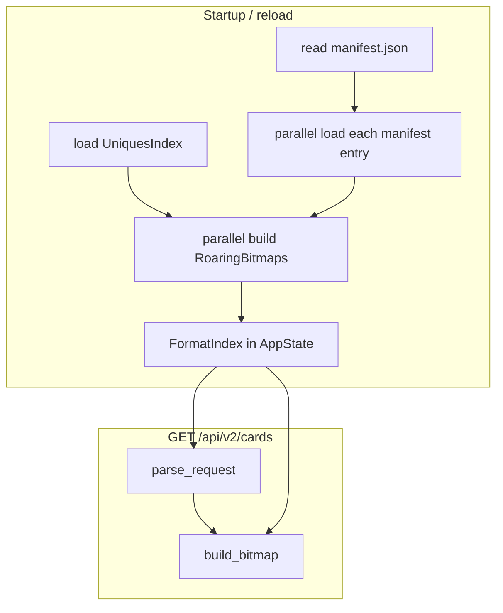

# Plan 17: HTTP API format filters

## Goal

Support `format=<formatID>` on card query endpoints. Each format is defined by a **JSON file outside the index**. At load time the server builds a `RoaringBitmap` per format and stores it in memory. At query time, requested formats are combined with existing filters:

- **Include** (`included_refs`) → `result &= format_bitmap`
- **Exclude** (`excluded_sets` and/or `excluded_refs`) → `result -= (result & format_bitmap)` within `total_bit_span`

At most **one** `format=<formatID>` per request (formats are mutually exclusive). It combines with other filters via AND / AND NOT like any other single filter group.

**User choices (confirmed):**

- If formats are **not enabled** (`[formats]` omitted / feature off) → **`400 unknown format '{id}'`** when a non-empty `format` param is present (after last-wins resolution); omit param → no format constraint
- **Hot-reload** when `formats.reload_interval_secs > 0` (independent of index reload); `0` or omitted = no formats polling
- Also rebuild format bitmaps after index hot-reload (formats depend on `catalog` + `set_bitmaps`)

---

## Architecture



Formats are **not** read from index `extra/` or `extra_catalog.json` ([`index-core/src/extra_catalog.rs`](../../index-core/src/extra_catalog.rs) stays CLI-only for now).

---

## Formats source layout

The formats source (e.g. `FormatsSourceConfig::Disk { path }`) is **manifest-driven**. Do not glob `*.json`; only entries listed in the manifest are loaded.

### `manifest.json`

Fixed filename at the source root: **`manifest.json`**. JSON array of entries:

```json
[
  { "id": "standard", "path": "standard.json", "version": 1234 },
  { "id": "frontier", "path": "frontier.json", "version": 1317675 }
]
```

| Field | Required | Description |
|-------|----------|-------------|
| `id` | yes | Format ID for `format=` query params (1–32 chars) |
| `path` | yes | Relative path to the format JSON file (under source root) |
| `version` | yes | Monotonic format version; must match the `version` inside the format JSON |

Trust the manifest as the catalog of formats (no directory scan). Paths not listed are ignored.

### Format JSON schema

One JSON file per manifest entry. `id` and `version` in the file must agree with the manifest row.

```json
{
  "id": "standard",
  "version": 1234,
  "included_refs": ["ALT_CORE_B_AX_04_U_1", "ALT_CORE_B_BR_05_U_2"]
}
```

```json
{
  "id": "frontier",
  "version": 1317675,
  "excluded_sets": ["CORE", "COREKS"],
  "excluded_refs": ["ALT_BISE_B_BR_59_U_5", "ALT_CYCLONE_B_YZ_73_U_874"]
}
```

| Field | Required | Semantics |
|-------|----------|-----------|
| `id` | yes | Must match manifest entry `id` |
| `version` | yes | Must match manifest entry `version` (u64) |
| `included_refs` | mode 1 | Positive filter: union refs → AND at query time |
| `excluded_sets` | mode 2 | Negated: union full set bitmaps into exclusion bitmap |
| `excluded_refs` | mode 2 | Negated: union refs into exclusion bitmap |

**Manifest ↔ file cross-check (per entry, before bitmap build):**

- Read format JSON at `source_root / manifest.path`
- `format.id` must equal `manifest.id`
- `format.version` must equal `manifest.version`
- Mismatch on either → per-format `Failed` (logged), same soft-failure rules as other load errors

**Mode rules (validated per file at load time):**

- Exactly one mode: either `included_refs` is non-empty, **or** at least one of `excluded_sets` / `excluded_refs` is non-empty
- Modes are **mutually exclusive** (`included_refs` cannot coexist with `excluded_*`)
- All lists may be present in mode 2; `excluded_sets` and `excluded_refs` are **OR**'d into one bitmap before AND NOT

**Per-format load failures (soft — server keeps running):**

- Any error building a single format (manifest/file `id` or `version` mismatch, invalid JSON/schema, mode violation, unknown set code, unresolvable ref, duplicate manifest `id`, missing file, etc.) must:
  1. **Log** a clear message to stderr (include format `id` and file path + error reason)
  2. **Register** the format in `FormatIndex` with status `Failed` (no bitmap)
  3. **Not** abort startup, index reload, or formats hot-reload — other formats continue to load normally
- Successfully loaded formats are queryable immediately; failed formats are not

---

## Config

Extend [`src/config.rs`](../src/config.rs) and [`config/default.toml`](../config/default.toml). Use a **tagged source enum** (variant-specific fields) plus a top-level reload interval — not a flat `source` kind + optional `path`.

```toml
# Entire [formats] section optional — omit = feature disabled

[formats]
# reload_interval_secs = 60   # optional; 0 or omitted = no formats hot-reload

[formats.source]
type = "disk"
path = "./formats"
```

Future sources add new variants without reshaping the top-level table, e.g.:

```toml
# [formats.source]
# type = "s3"
# api_key = "..."
# bucket_name = "my-formats-bucket"
```

```rust
#[derive(Debug, Clone, Deserialize)]
pub struct Settings {
    pub server: ServerSettings,
    pub index: IndexSettings,
    #[serde(default)]
    pub formats: Option<FormatsSettings>,
}

#[derive(Debug, Clone, Deserialize)]
pub struct FormatsSettings {
    pub source: FormatsSourceConfig,
    /// Poll for format file changes when > 0. `0` or absent = disabled.
    #[serde(default)]
    pub reload_interval_secs: u64,
}

/// Deserialized config — one variant per source type, each carrying its own fields.
#[derive(Debug, Clone, Deserialize)]
#[serde(tag = "type", rename_all = "snake_case")]
pub enum FormatsSourceConfig {
    Disk { path: String },
    // S3 { api_key: String, bucket_name: String },  — future iteration
}

impl FormatsSettings {
    pub fn is_enabled(&self) -> bool {
        match &self.source {
            FormatsSourceConfig::Disk { path } => !path.trim().is_empty(),
        }
    }

    pub fn reload_interval_secs(&self) -> Option<u64> {
        (self.reload_interval_secs > 0).then_some(self.reload_interval_secs)
    }
}
```

Runtime loader in [`formats/source.rs`](../src/formats/source.rs) mirrors the config enum:

```rust
pub enum FormatsSource {
    Disk(DiskFormatsSource),
    // S3(S3FormatsSource),  — future
}

impl FormatsSource {
    pub fn from_config(cfg: &FormatsSourceConfig) -> Self { ... }
}
```

v1 implements **`Disk(DiskFormatsSource)`** only; additional variants are stubbed in the config enum comments / left for a future iteration.

| Field | Required | Description |
|-------|----------|-------------|
| `source` | yes (when section present) | Tagged enum (`[formats.source]` table); v1: `type = "disk"` + `path` |
| `source.path` | yes for `disk` | Formats source root containing `manifest.json` |
| `reload_interval_secs` | no | Hot-reload poll interval; **`0` or unset = disabled** |

- Env override: `FORMATS_PATH` → overrides `path` on `FormatsSourceConfig::Disk` (mirror `INDEX_PATH` style)
- Feature **disabled** when `[formats]` is omitted → any `format=` request returns **`400 unknown format '{id}'`**
- Feature **enabled** when `[formats]` is present with a valid source (non-empty disk `path` for v1): loader always succeeds; individual file errors produce `Failed` entries (logged), not server exit
- Validation: if `reload_interval_secs > 0`, feature must be enabled (`is_enabled()`)

---

## New module: `formats` (parent-file layout, no `mod.rs`)

Follow the repo convention ([`index.rs`](../src/index.rs) + [`index/`](../src/index/)): **`formats.rs`** is the module root; child files live in a sibling **`formats/`** directory.

| File | Responsibility |
|------|----------------|
| [`formats.rs`](../src/formats.rs) | `mod` declarations + `pub use` re-exports |
| [`formats/schema.rs`](../src/formats/schema.rs) | `FormatsManifestEntry`, `FormatDefinition` serde types + validation |
| [`formats/build.rs`](../src/formats/build.rs) | bitmap construction from definition + `UniquesIndex` |
| [`formats/source.rs`](../src/formats/source.rs) | `FormatsSource` enum; v1 `Disk(DiskFormatsSource)` reads local directory |
| [`formats/loader.rs`](../src/formats/loader.rs) | read `manifest.json`, parallel load entries, produce `FormatIndex` |
| [`formats/reload.rs`](../src/formats/reload.rs) | manifest version snapshot compare + `spawn_formats_hot_reload` |

Wire in [`lib.rs`](../src/lib.rs): `mod formats;` + export `FormatIndex`, `spawn_formats_hot_reload`, etc. as needed.

### `FormatIndex` (in-memory)

```rust
pub enum FormatLoadStatus {
    Ready { negated: bool, bitmap: RoaringBitmap },
    Failed,
}

pub struct LoadedFormat {
    pub id: String,
    pub status: FormatLoadStatus,
}

pub struct FormatIndex {
    by_id: BTreeMap<String, LoadedFormat>,
    /// manifest id → version snapshot used for hot-reload detection
    manifest_versions: BTreeMap<String, u64>,
}

impl FormatIndex { /* lookup by id */ }
```

Whether `format` query params are honored is determined by **`FormatsSettings::is_enabled()`** on the immutable `Settings` (not stored in `AppState`), not by whether any formats loaded successfully. A configured source with all files failed still treats `format=` as active (unknown → 400, failed id → 500).

### Manifest-driven loading

In [`formats/loader.rs`](../src/formats/loader.rs), use `std::thread::scope` (no new dependency):

1. Read and parse `manifest.json` from source root
   - If missing or invalid: log error, return `Ok(FormatIndex { by_id: empty, manifest_versions: empty })` — server still starts; all `format=` ids → 400 unknown
2. **Parallel** (one task per manifest entry):
   - Resolve `source_root / entry.path`
   - Read + deserialize `FormatDefinition`
   - Cross-check `entry.id` / `entry.version` against `format.id` / `format.version`
   - Validate mode rules + build bitmap
3. **Sequential** merge into `by_id`:
   - On per-entry `Err`: `eprintln!(...)` and insert `LoadedFormat { id: entry.id, status: Failed }`
   - On per-entry `Ok`: insert `Ready { negated, bitmap }`
   - On duplicate manifest `id`: log error, mark the duplicate as `Failed` (first successful entry wins)
4. Store `manifest_versions: entry.id → entry.version` for every manifest row (including `Failed` entries), so hot-reload can detect version bumps even when a format is broken
5. Always return `Ok(FormatIndex)` — loader never fails the server boot/reload path

Bitmap build reuses existing set union logic from [`src/index/query/cards.rs`](../src/index/query/cards.rs) (`union_requested_sets`) and a new shared ref→bitmap helper.

### Shared ref→bitmap helper (index-core)

Extract from [`index-core/src/add_extra_filter.rs`](../../index-core/src/add_extra_filter.rs) a public function:

```rust
// index-core/src/refs_bitmap.rs (or catalog.rs)
pub fn build_bitmap_from_refs(catalog: &Catalog, refs: &[&str]) -> Result<RoaringBitmap>
```

Used by both `add_extra_filter` (line-based file) and format loader (JSON arrays). Keeps ref resolution consistent with the CLI.

---

## AppState, Settings, and hot-reload

**Split mutable runtime state from immutable config** (same pattern as index reload settings today — `Settings` is not in `AppState`).

### `AppState` — hot-swappable data only

Extend [`src/http/state.rs`](../src/http/state.rs). Index and formats are swapped **together** so queries never see a new `UniquesIndex` paired with bitmaps built against an old catalog.

```rust
pub struct QuerySnapshot {
    pub index: Arc<UniquesIndex>,
    pub formats: Arc<FormatIndex>,
}

pub struct AppState {
    query: RwLock<Arc<QuerySnapshot>>,
}
```

New methods:

- `snapshot() -> Arc<QuerySnapshot>` — clone current index + formats atomically
- `commit(Arc<QuerySnapshot>)` — replace the whole snapshot (index rotation, formats reload, or both)

`FormatsSettings` does **not** live here; it is immutable for the server lifetime.

### Keeping format bitmaps in sync with `UniquesIndex`

Format `Ready { bitmap }` values are **`card_index` sets** in the loaded index's bit space. They are built by:

- resolving `included_refs` / `excluded_refs` via **`catalog.lookup_bit`**
- unioning `excluded_sets` via **`set_bitmaps`**

Those mappings are **index-specific**. After a merged index reload, the same reference string can map to a different `card_index`, and set spans can change. **There is no safe way to remap or patch existing format bitmaps in place.**

**Strategy: full rebuild, not incremental sync.**

| Event | Action |
|-------|--------|
| Startup | Load `UniquesIndex`, then `load_format_index(&index, formats_settings)` → one `QuerySnapshot` |
| **Index hot-reload** (rotation) | In the same `spawn_blocking` task: load new index → **rebuild entire `FormatIndex` from manifest + format JSON against the new index** → `commit` both atomically. Old format bitmaps are dropped. |
| Formats hot-reload (manifest version change) | Re-read manifest/files, rebuild bitmaps against **current** index → `commit` with same index + new formats |
| Formats disabled | On index rotation, `commit` with empty/default `FormatIndex` |

Format **definitions** (manifest + JSON on disk) are unchanged on index rotation; only the derived Roaring bitmaps are recomputed.

```mermaid
sequenceDiagram
  participant Tick as reload_tick
  participant Block as spawn_blocking
  participant State as AppState

  Tick->>Block: load new UniquesIndex
  Block->>Block: load_format_index(new_index, settings)
  Block->>State: commit QuerySnapshot index+formats
  Note over State: Old FormatIndex dropped; no bitmap remapping
```

If format rebuild fails partially, per-format `Failed` entries apply as usual; the snapshot still commits (index must not stay on old index with stale pairing — rebuild always runs against the index being committed).

### `Settings` — immutable, owned by `main`

`FormatsSettings` stays inside `Settings` (deserialized once). In [`main.rs`](../src/main.rs):

```rust
let settings = Arc::new(load_settings()?);
let state = Arc::new(load_app_state(&settings)?);

// background tasks capture Arc<Settings> + Arc<AppState>
spawn_formats_hot_reload(Arc::clone(&state), Arc::clone(&settings), ...);
```

Reload/build helpers take config as an argument:

```rust
// formats/loader.rs — always called with the UniquesIndex the bitmaps must match
pub fn load_format_index(index: &UniquesIndex, formats: &FormatsSettings) -> FormatIndex { ... }
```

### Axum router state

Extend [`http.rs`](../src/http.rs) so handlers can read both without putting config in `AppState`:

```rust
#[derive(Clone)]
pub struct ServerState {
    pub app: Arc<AppState>,
    pub settings: Arc<Settings>,
}

pub fn app(server: ServerState) -> Router { ... }
```

Handlers use `State<ServerState>` (or thin extractors over it). `IndexSnapshot` reads `server.app.snapshot().index`. Feature gating: `server.settings.formats.as_ref().is_some_and(|f| f.is_enabled())`.

### Hot-reload wiring

**Index hot-reload** ([`reload/tick.rs`](../src/index/reload/tick.rs)): pass `Arc<Settings>` into `spawn_hot_reload` / `reload_tick`. In `spawn_blocking`: load new index → if formats enabled, `load_format_index(&new_index, …)` → `commit(QuerySnapshot { index, formats })` in one step. Skip commit if new index is not strictly newer (`built_at_secs`).

**Formats hot-reload** ([`formats/reload.rs`](../src/formats/reload.rs)):

- Poll every `formats.reload_interval_secs` when **> 0**
- Each tick: read `manifest.json` only (cheap), build `BTreeMap<id, version>`
- If snapshot differs from current `FormatIndex.manifest_versions`, rebuild in `spawn_blocking` against **current** index, then `commit` with same index + new formats
- Only spawned when `FormatsSettings::is_enabled()` **and** `reload_interval_secs > 0`

---

## Query integration

### Parsing — [`src/http/api/cards/parse.rs`](../src/http/api/cards/parse.rs)

- Add `parse_format(params) -> Option<String>`:
  - Read **only** the `format` query key (no `format[]`, no CSV)
  - Formats are **mutually exclusive** — at most one active format per request
  - If `format` appears multiple times in the query string, **keep the last** non-empty value; discard earlier ones
- Extend `parse_request(index, format_index, formats_settings, params)`:
  - Resolve `format` via `parse_format` first
  - If formats are **not enabled** (`settings.formats` absent / `!is_enabled()`):
    - Any resolved format id → **`400 unknown format '{id}'`**
    - Otherwise → `req.format = None`
  - Else if a format id is present:
    - Not in `by_id` → `400 unknown format '{id}'`
    - `status == Failed` → `500` with body message **`format failed to load`** (exact string)
    - `status == Ready` → `req.format = Some(id)`
  - Else → `req.format = None`
- Add `format: Option<String>` to [`CardsRequest`](../src/http/api/cards/models.rs) (not a list)

Use existing `internal_server_error` / equivalent helper in [`http/api/error.rs`](../src/http/api/error.rs) for the 500 case.

### Bitmap — [`src/index/query/cards.rs`](../src/index/query/cards.rs) `build_bitmap`

After existing filter groups, if `req.format` is set (validated `Ready` at parse time):

```rust
if let Some(id) = &req.format {
    let FormatLoadStatus::Ready { negated, bitmap } = &format_index.by_id[id].status;
    if *negated {
        out -= &(&out & bitmap);
    } else {
        out &= bitmap;
    }
}
```

If the requested format is `Failed`, `parse_request` returns before `build_bitmap` runs.

### Handlers

Update [`cards/handlers.rs`](../src/http/api/cards/handlers.rs) and [`effects/handlers.rs`](../src/http/api/effects/handlers.rs):

- Take `State<ServerState>` (or update `IndexSnapshot` to read from `ServerState.app`)
- Pass `state.app.snapshot()` and `state.settings` into `parse_request` and `build_bitmap`

`/api/v2/effects/filtered` automatically inherits format filtering since it already calls the same parse + `build_bitmap` pipeline.

---

## Tests

| Location | Cases |
|----------|-------|
| `formats/build.rs` unit tests | positive refs; negated sets; negated sets+refs union; validation errors |
| `formats/loader.rs` integration | manifest + 2 format files; version/id mismatch → `Failed`; bad ref → `Failed`; duplicate manifest id → `Failed`; broken manifest → empty index |
| `formats/reload.rs` tests | manifest version bump triggers reload; unchanged manifest skips reload |
| [`cards/query/cards.rs` tests](../src/index/query/cards.rs) | include format AND with effect filter; exclude format removes set span; repeated `format=` keeps last; unknown id 400 when configured |
| `parse.rs` tests | no `format` param when disabled → OK; `format=` when disabled → 400 `unknown format '{id}'`; `format=a&format=b` → uses `b`; errored format → 500 `"format failed to load"` |
| `http/state.rs` or reload tests | index rotation rebuilds format bitmaps; commit swaps index+formats atomically |

Extend test fixtures in [`test_support`](../src/http/api/cards/test_support.rs) to optionally attach a `FormatIndex`.

---

## Documentation

Update [`docs/api-spec.md`](../../docs/api-spec.md) with `format` query param semantics (single value, last wins if repeated), `manifest.json` layout, format JSON schema (including `version`), and config keys.

---

## Implementation checklist

1. Extract `build_bitmap_from_refs(catalog, refs)` in index-core; reuse from `add_extra_filter`
2. Add `formats/` module: manifest + `FormatDefinition` schema, version cross-check, parallel loader, `Ready`/`Failed` `FormatIndex`
3. Add `FormatsSettings` tagged enum in config; `QuerySnapshot` (index+formats) in `AppState` with atomic `commit`; `Arc<Settings>` outside `AppState`
4. Manifest version snapshot reload when `reload_interval_secs > 0`; rebuild formats after index hot-reload
5. `parse_format` (single, last-wins) + `CardsRequest.format`; 500 on `Failed` format; `build_bitmap` AND/AND-NOT; update handlers
6. Unit/integration tests; update `api-spec.md`

---

## Out of scope

- `FormatsSourceConfig` variants other than **`Disk { path }`** (e.g. S3); enum shape is in place, implementations deferred
- `included_sets` (not in spec)
- CLI command to author format JSON files
- `merge` propagating format definitions across set indexes
