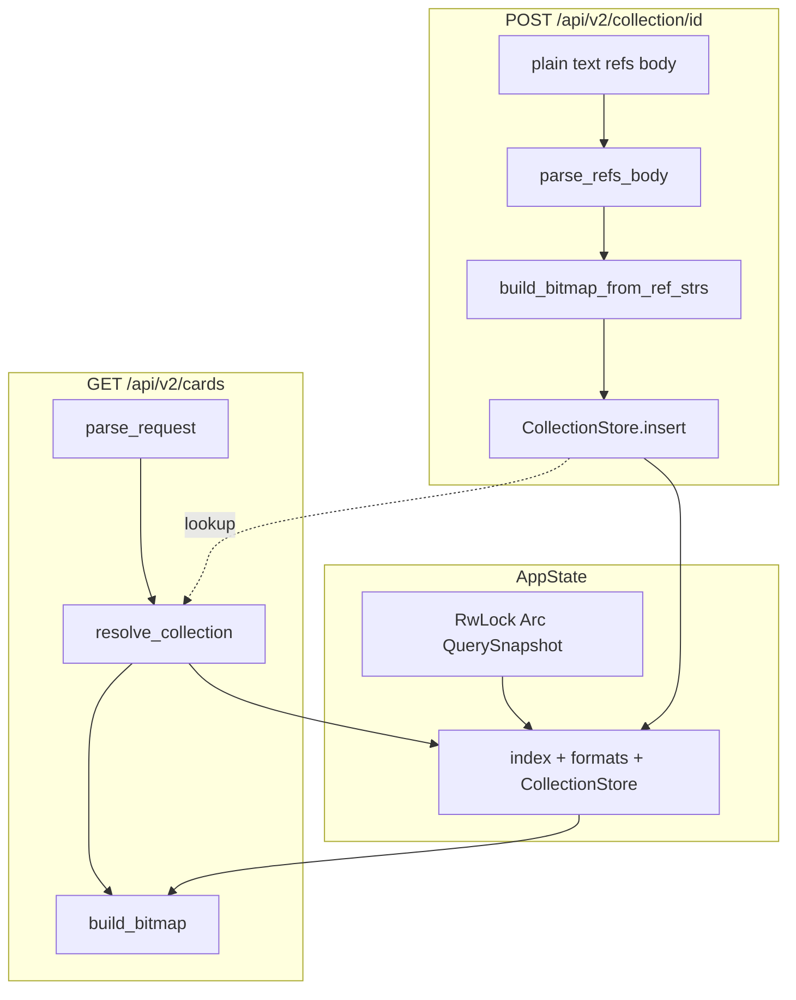

# Plan 18: User-defined Collections

## Goal

Allow clients to upload custom reference-ID lists ("Collections") at runtime and use them as include-only filters on card queries — similar to format `included_refs`, but ephemeral and user-driven.

| Operation | Behavior |
|-----------|----------|
| `POST /api/v2/collection/{collectionId}` | Body = newline-separated reference IDs; build OR bitmap; store in LRU cache |
| `GET /api/v2/cards?collection={id}` (also `/api/v2/effects/filtered`) | AND collection bitmap into existing filter groups |
| Missing collection on query | **422** `{ "error": "collection_not_loaded", "collection": "{id}" }` |

**Constraints (confirmed):**
- Reference IDs only (reuse [`index_core::build_bitmap_from_ref_strs`](../../index-core/src/refs_bitmap.rs))
- Include-only (non-negated): `result &= collection_bitmap`
- Collection ID: 4–36 chars (trimmed); alphanumeric + `_` + `-` (same spirit as format IDs)
- At most one `collection=` per request, last-wins (mirror [`parse_format`](../src/http/api/cards/parse.rs))
- Memory-bounded cache via **mini-moka** `sync::Cache` with byte weigher + optional TTL/TTI (config-driven)

---

## Architecture



Collections live **inside `QuerySnapshot`**, which is guarded by `AppState`'s `RwLock<Arc<QuerySnapshot>>` — same atomic unit as index + formats. Collection bitmaps are built against the snapshot's catalog; they must not outlive an incompatible index swap.

**Index reload / compatibility (v1):** on `commit_if_newer`, when the index is replaced (`built_at_secs` strictly increases), treat all existing collections as **incompatible** and publish a new `QuerySnapshot` with a **fresh empty `CollectionStore`** (same `CollectionsSettings`, new mini-moka instance). This is atomic under the write lock — no window where a query reads a new index paired with old bitmaps. In-flight requests holding a cloned `Arc<QuerySnapshot>` from before the swap continue against the old index+collections pair until they finish.

**Future extension:** if a later reload is deemed **compatible** (e.g. identical catalog fingerprint / `built_at_secs` unchanged), the reload path could retain the previous `CollectionStore` instead of discarding it.

---

## New module: `collections`

Follow the repo's modern module layout ([`rust-modules.mdc`](../../.cursor/rules/rust-modules.mdc)): **no `mod.rs`**. Mirror [`formats.rs`](../src/formats.rs) + `formats/` subdirectory.

| File | Responsibility |
|------|----------------|
| [`collections.rs`](../src/collections.rs) | Parent module: `mod store; mod parse; mod build;` + `pub use` re-exports (`CollectionStore`, etc.) |
| [`collections/store.rs`](../src/collections/store.rs) | `CollectionStore` wrapping `mini_moka::sync::Cache<String, Arc<RoaringBitmap>>` |
| [`collections/parse.rs`](../src/collections/parse.rs) | `validate_collection_id`, `parse_refs_body` (one ref/line; trim; skip blank/`#` comments — same rules as [`build_bitmap_from_refs_file`](../../index-core/src/refs_bitmap.rs)) |
| [`collections/build.rs`](../src/collections/build.rs) | `build_collection_bitmap(catalog, refs) -> Result<RoaringBitmap>` thin wrapper over `index_core::build_bitmap_from_ref_strs` + `validate_bitmap_span` |

Register in [`lib.rs`](../src/lib.rs): `mod collections;`

**`CollectionStore` API:**
- `fn new(settings: &CollectionsSettings) -> Self`
- `fn insert(&self, id: &str, bitmap: Arc<RoaringBitmap>)`
- `fn get(&self, id: &str) -> Option<Arc<RoaringBitmap>>`
- `fn clear(&self)`

**Cache builder knobs** (from `CollectionsSettings`):
- **Weigher:** `key.len() + bitmap.serialized_size()`; `max_capacity` = `max_memory_bytes`
- **TTL** (`time_to_live_secs > 0`): entry expires after that many seconds from **insert** (re-POST resets the clock)
- **TTI** (`time_to_idle_secs > 0`): entry expires after that many seconds without **get** or **insert** (query `collection=` calls `get`, extending idle lifetime)

Omit either setting or set to `0` to disable that expiration policy (entries then only evicted by memory pressure or dropped when the snapshot is replaced on incompatible index reload).

**Dependency:** add `mini-moka = "0.10"` to [`Cargo.toml`](../Cargo.toml).

---

## Configuration

Extend [`config.rs`](../src/config.rs):

```toml
[collections]
max_memory_bytes = 33554432      # 32 MiB
time_to_live_secs = 0            # 0 = disabled; e.g. 3600 = expire 1h after POST
time_to_idle_secs = 0            # 0 = disabled; e.g. 1800 = expire 30m after last use
```

**`CollectionsSettings`:**

```rust
pub struct CollectionsSettings {
    pub max_memory_bytes: u64,
    #[serde(default)]
    pub time_to_live_secs: u64,
    #[serde(default)]
    pub time_to_idle_secs: u64,
}
```

- Add to `Settings` with `#[serde(default)]` on the `collections` field (section optional; when absent, use `CollectionsSettings::default()` for tests)
- **`validate_settings` rules:**
  - `max_memory_bytes > 0`
  - `time_to_live_secs` and `time_to_idle_secs` may be `0` (disabled) or `> 0`
  - Reject unreasonably large values (e.g. cap at 10 years) to avoid mini-moka builder panic (>1000 years)
- **`CollectionStore::new`:** build mini-moka cache with weigher + `max_capacity`; call `.time_to_live(Duration::from_secs(...))` only when `time_to_live_secs > 0`; same for `.time_to_idle(...)` when `time_to_idle_secs > 0`
- Wire into [`build_app_state`](../src/index/loader.rs): initial `QuerySnapshot` includes `CollectionStore::new(&settings.collections)`

Update [`config/default.toml`](../config/default.toml) with the full `[collections]` section. Per-environment overrides (e.g. [`local.toml`](../config/local.toml)) can tune TTL/TTI without changing memory budget.

---

## State changes

[`http/state.rs`](../src/http/state.rs):

```rust
#[derive(Clone)]
pub struct QuerySnapshot {
    pub index: Arc<UniquesIndex>,
    pub formats: Arc<FormatIndex>,
    pub collections: CollectionStore,
}

pub struct AppState {
    query: RwLock<Arc<QuerySnapshot>>,
}
```

- Extend `QuerySnapshot` with `collections: CollectionStore` (mini-moka is internally thread-safe; `CollectionStore` should be `Clone` via shared cache handle)
- `AppState::new(snapshot)` / `new_with_index(index, collections_settings)` — initial snapshot includes empty `CollectionStore::new(settings)`
- Access via existing `snapshot()` → `snapshot.collections.get(...)` / `.insert(...)` (no separate `AppState::collections()` field)
- **`commit_if_newer`:** on swap, build new snapshot atomically:

```rust
QuerySnapshot {
    index: new_index,
    formats: new_formats,
    collections: CollectionStore::new(collections_settings), // incompatible → discard old
}
```

  Pass `&CollectionsSettings` into `commit_if_newer` from the hot-reload caller ([`ServerState.settings`](../src/http/state.rs) already available at reload sites)

- **Concurrency:** index reload takes `RwLock` write; POST/query collection ops use mini-moka on the current `Arc<QuerySnapshot>` without write lock (read lock + `Arc::clone` only)

[`ServerState::for_test`](../src/http/state.rs): small `CollectionsSettings` budget in test `QuerySnapshot`.

---

## HTTP endpoints

### New router module

Same layout as [`cards.rs`](../src/http/api/cards.rs) + `cards/handlers.rs` (no `mod.rs`):

| File | Responsibility |
|------|----------------|
| [`http/api/collections.rs`](../src/http/api/collections.rs) | `mod handlers;` + `router()` |
| [`http/api/collections/handlers.rs`](../src/http/api/collections/handlers.rs) | `post_collection` handler |

```rust
Router::new()
    .route("/api/v2/collection/{collection_id}", post(handlers::post_collection))
```

Merge in [`http/api.rs`](../src/http/api.rs): `pub mod collections;` + `.merge(collections::router())`.

### `POST /api/v2/collection/{collectionId}`

Handler signature: `State<ServerState>`, `Path<String>`, `String` body (plain text).

Flow:
1. `validate_collection_id(&collection_id)` — **400** if length/charset invalid
2. `parse_refs_body(&body)` — **400** if zero refs after parsing
3. `server.app.snapshot().index` → `build_collection_bitmap(catalog, &refs)`
   - Invalid ref syntax / not in catalog → **400** with `error` message (existing `bad_request` style, include ref context from anyhow chain)
4. `server.app.snapshot().collections.insert(id, Arc::new(bitmap))` (same `Arc<QuerySnapshot>` as step 3's index)
5. **200** `{ "collection": "{id}", "count": N }` (`count` = deduped refs resolved)

Re-POST to same ID overwrites the entry (upsert).

### Query param `collection=`

In [`parse_request`](../src/http/api/cards/parse.rs):

1. Add `parse_collection(params) -> Option<String>` (last-wins, like `parse_format`)
2. Add `resolve_collection(id, store) -> ApiResult<()>`
   - ID present but not in cache → **422** `collection_not_loaded`
   - ID present and valid length but missing → same 422
3. Add `collection: Option<String>` to [`CardsRequest`](../src/http/api/cards/models.rs)

Update call sites:
- [`get_cards_v2`](../src/http/api/cards/handlers.rs)
- [`get_effects_filtered`](../src/http/api/effects/handlers.rs)

Pass `server.app.snapshot().collections` into `parse_request` (same snapshot as index/formats).

### `build_bitmap` integration

In [`index/query/cards.rs`](../src/index/query/cards.rs), after format handling (~line 135):

```rust
if let Some(id) = &req.collection {
    if let Some(bitmap) = collection_store.get(id) {
        groups.push((*bitmap).clone()); // include-only AND
    }
}
```

Change signature to accept `collection_store: &CollectionStore`. Collection is already validated at parse time, so `get` should always hit; defensive miss → empty result or internal error (prefer unreachable if parse guarantees presence).

**Combine semantics:** `collection` ANDs with `format` and all other filters (both are separate include groups).

---

## Error responses

Extend [`http/api/error.rs`](../src/http/api/error.rs):

- Change `ApiResult` error payload to `Json<serde_json::Value>` so structured 422 bodies work without breaking existing `{ "error": "..." }` responses
- Add `collection_not_loaded(collection_id: String) -> (StatusCode, Json<serde_json::Value>)` returning **422** with exact shape requested

Existing helpers (`bad_request`, `not_found`, etc.) continue emitting `{ "error": message }`.

---

## Tests

| Layer | What to cover |
|-------|----------------|
| `collections/parse.rs` | ID length 3→400, 37→400; body skips blanks/comments; empty body→400 |
| `collections/store.rs` | insert/get; memory eviction; TTL expiry after insert; TTI expiry after idle (use `tokio::time::sleep` or manual clock if needed — mini-moka uses real time) |
| `parse.rs` | `collection=` last-wins; unknown id→422 body shape; valid id after POST→OK |
| `tests/collections.rs` (new integration) | POST two fixture refs → `GET /api/v2/cards?collection=...` returns only those cards; query without POST→422 |
| Update existing `parse_request` / `build_bitmap` unit tests | Pass `CollectionStore::new(test_budget)` |
| `http/state.rs` tests | `commit_if_newer` replaces snapshot with empty collections (POST'd id → 422 after swap) |

Use fixture index refs from [`tests/fixtures/minimal_index`](../tests/fixtures/minimal_index) (`ALT_TEST_B_AX_04_U_1`, etc.).

---

## Key files summary

| File | Change |
|------|--------|
| [`Cargo.toml`](../Cargo.toml) | `mini-moka` dep |
| [`config.rs`](../src/config.rs) + [`default.toml`](../config/default.toml) | `[collections]` settings (`max_memory_bytes`, `time_to_live_secs`, `time_to_idle_secs`) |
| [`http/state.rs`](../src/http/state.rs) | `CollectionStore` in `QuerySnapshot` inside `RwLock`; fresh store on incompatible index swap |
| [`collections.rs`](../src/collections.rs) + [`collections/`](../src/collections/) | new module (parent `.rs` + submodules, no `mod.rs`) |
| [`http/api/collections.rs`](../src/http/api/collections.rs) + [`collections/handlers.rs`](../src/http/api/collections/handlers.rs) | POST route |
| [`http/api/cards/parse.rs`](../src/http/api/cards/parse.rs) | `collection=` parsing + 422 |
| [`http/api/cards/models.rs`](../src/http/api/cards/models.rs) | `CardsRequest.collection` |
| [`index/query/cards.rs`](../src/index/query/cards.rs) | AND collection bitmap |
| [`http/api/error.rs`](../src/http/api/error.rs) | 422 helper + `ApiResult` JSON body |
